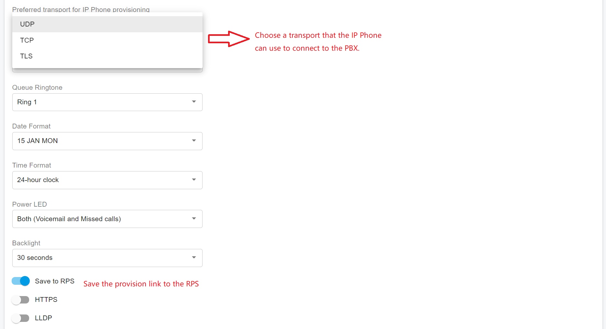

# Provision Phone Using RPS

In case PortSIP PBX is located in the cloud, IP Phones can be auto-provisioned via RPS (Redirection and Provisioning Service).&#x20;

PortSIP PBX supports [Fanvil](https://www.fanvil.com), [Yealink](https://www.yealink.com), [SNOM](https://www.snom.com), [ALE](https://www.al-enterprise.com/), and [Htek ](https://www.htek.com/)RPS. If you are using an IP phone from one of the providers mentioned above, you can configure your IP phone easily without the need to manually copy the auto-provisioning link. In this scenario, the PnP method is unavailable.

<figure><figcaption></figcaption></figure>

## Add the Phone

1. From the **Call Manager** > **Phones** menu in the PortSIP PBX Web Portal, click **Add Phone**.
2. Select an extension that is for phone use.
3. Enter the MAC address of the phone (which can be found at the bottom of the phone).
4. Select the appropriate phone model from the drop-down menu.
5. Select **Phone Display Language** and **Timezone** for the phone.
6. Enter the password for access the IP Phone web portal.
7. Turn on the **Save to RPS** option.
8. Click the **OK** button, and the PortSIP PBX will save the provisioning link to the IP Phone's RPS. When the IP Phone is powered on, it will query the provisioning link from the RPS server using its MAC address to complete the auto-provisioning.

<figure><figcaption></figcaption></figure>

As shown in the screenshot above, you can set a password for the IP Phone web portal, and choose a network interface that the IP Phone can use to connect to PBX. This value usually refers to the **Outbound Proxy Server** for the IP Phone. Since the PBX is located in the cloud, usually need to choose the public IP for the **Network**.

<figure><figcaption></figcaption></figure>

As shown in the screenshot above, you can choose a **transport** that the IP Phone can use to connect to the PBX. The **Save to RPS** option indicates that you can save the provisioning link to the IP Phone RPS, in case it must be turned on here. The **HTTPS** option is used to generate the provisioning link for HTTPS or not.

## **Restart the IP Phone**

When a phone is starting, it will query the provisioning link from the RPS server using its MAC address to complete the auto-provisioning. Once the IP Phone is successfully provisioned, it will register to the PortSIP PBX automatically. You can see the phone in the below screenshot in the **Call Manager > Phones** menu.

<figure><figcaption></figcaption></figure>

