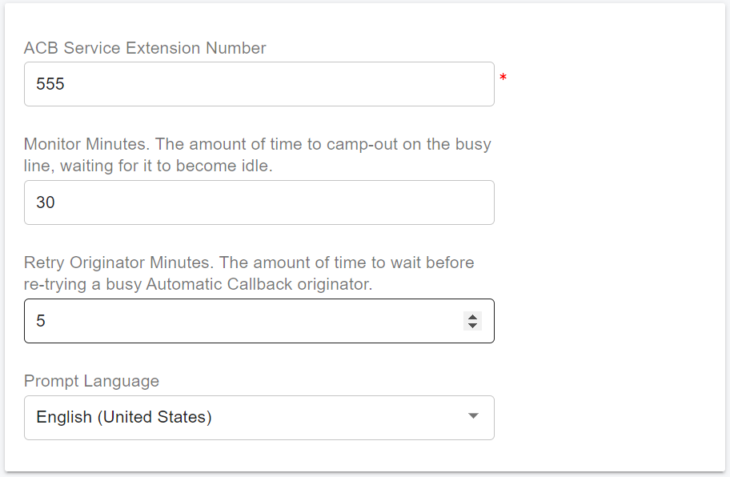

# DND and Automatic Callback

## Do Not Disturb

Do Not Disturb (DND) is a feature that allows you to silence incoming call notifications when you need to focus and avoid interruptions. The calls will be sent directly to voicemail when DND is activated. You can activate or deactivate DND in the following ways:

* Dial the feature access code (FAC) `*78` from an APP or IP Phone to activate DND and dial `*79` to disable it.
* Click the menu **Call Manager > Users**, select a user, and edit it. In the **Extension** page, toggle the **Do Not Disturb option** on or off. When DND is activated, a DND icon will appear in the user list to indicate the status.&#x20;

## Automatic Callback

The **Automatic Callback (ACB)** service allows users to monitor a busy party and automatically establish a call when the busy party becomes idle. Upon reaching a valid ACB busy condition, the user(s) hears an announcement asking if they would like to monitor the line and be called back when it is idle.

Users can activate the Automatic Callback in the following ways:

* Dial the feature access code (FAC) `*33` from an APP or IP Phone to activate ACB and dial `*43` to disable it.
* Click the menu **Call Manager > Users**, select a user, and edit it. On the **Extension** page, toggle the **Automatic Callback** on or off. When ACB is activated, an ACB icon will appear in the user list to indicate the status.&#x20;

Automatic Callback is an outgoing call feature that allows a user to place a call to another user in the same tenant. If the user you called is busy, the caller can book Automatic Callback and be notified when the called user is idle. When notified, a new call will be made to the idle user automatically and the caller user is not required to redial the number. The new call attempt is treated as an originating call attempt; For the new call setup to be attempted, both parties must be available.

### Operating Parameters

ACB has several operating parameters that are configured at the tenant level, click the menu **Advanced Services > Automatic Callback**:

* **ACB Service Extension Number**: the default extension number for the ACB service, suggest don't change it.
* **Monitor Minutes**: The amount of time to camp-out on the busy line, waiting for it to become idle. (30 minutes)
* **Retry Originator Minutes**: The amount of time to wait before re-trying a busy Automatic Callback originator (the owner of the ACB session). (5 minutes)
* **Prompt Language**: The prompts language.

<figure><figcaption></figcaption></figure>
