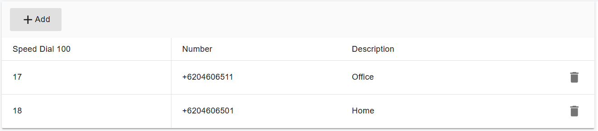

# Speed Dial 100

Speed Dial 100 allows you to assign the numbers you call most. Once programmed you just dial two digits(00-99). You can program this two ways: via the personal web portal or dialing the FAC from IP Phone/Softphone. The web portal is a bit easier to manage and confirm accuracy, but either way can work.

## Configuring Speed Dial 100 in the Web Portal 

You can configure Speed Dial 100 in the PortSIP PBX Web Portal through the following steps:

1. **For Tenant Admins**:
   * Log in to the Web Portal as a tenant administrator.
   * Navigate to **Call Manager > Users**, select the desired extension, and click the **Speed Dial 100** tab to set up speed dialing options.
2. **For Extension Users**:
   * Log in to the Web Portal as an extension user.
   * Go to the **Profile** menu, then click the **Speed Dial 100** tab to configure your speed dialing settings.

<figure><figcaption></figcaption></figure>

## Configuring Speed Dial 100 Using Feature Access Codes (FAC) 

You can also set up Speed Dial 100 by dialing the Feature Access Code (FAC) directly from your phone or app.

### Setting a Speed Dial Code

To program speed dial code **06** for the phone number **0015620671**:

1. From your phone, dial `*75060015620671`.
2. The PBX will play a voice prompt to confirm whether the setup was successful.

Once configured, you can use the speed dial by simply dialing the single digit 06 on your phone, and the PBX will automatically call **0015620671**.

### Modifying Speed Dial Code Settings

* To update the number for an existing speed dial code, dial `*75060033125`. This will replace the current number for code **06** with **0033125**.

### Deleting a Speed Dial Code

* To delete the settings for speed dial code **06**, dial `*7506*` from your phone. This will remove the speed dial configuration for code 06.

