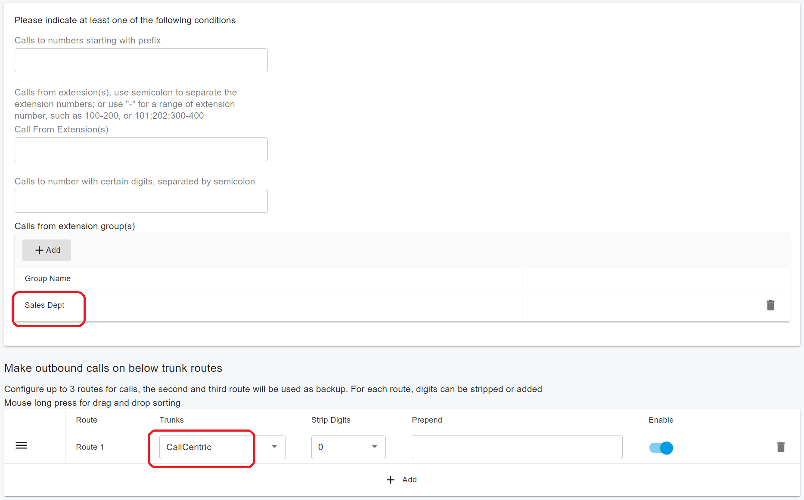

# User Groups

User groups allow you to add users to a group and then assign the outbound caller ID to this group.

If an outbound rule was created with the caller user group criteria, the PBX will replace the FROM header of the call INVITE message with the user group's outbound caller ID when a member of the user group dials the call that matched this outbound rule.

## Create a user group

To create the user group, go to **Call Manager > User Groups** and click the **Add** button.&#x20;

The below screenshot shows creating a user group named **Sales Dept** and giving the outbound caller ID as 010000 on trunk **CallCentric**.

<figure><figcaption></figcaption></figure>

## Create an outbound rule with  caller user group criteria

Create an outbound rule with the caller user group criteria and select the previously created **Sales Dept** group.

<figure><figcaption></figcaption></figure>

When an extension in the group **Sales Dept** dials a call that matches this outbound rule, the group's outbound caller ID is used as the user part of the FROM header in the INVITE SIP message.

