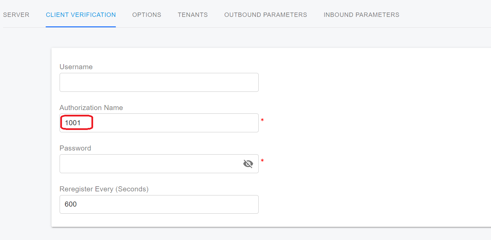
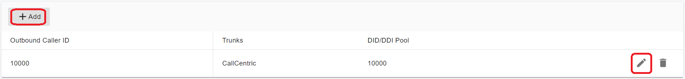
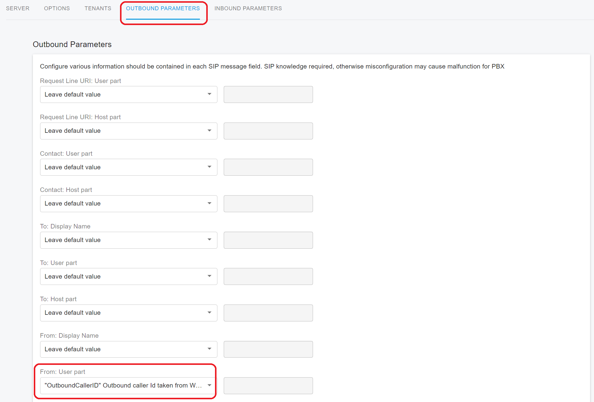
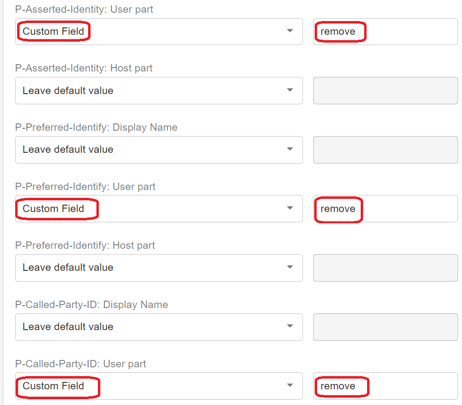

# Handle Outbound Calls Through SIP Trunk

This topic describes how PortSIP PBX handles outbound calls through a SIP trunk. Specifically, the INVITE message structure and how the SIP field values are populated.

## **DID Pool**

To understand the concept of Direct Inward Dialing (DID), please refer to the article [_What is Direct Inward Dialing (DID)_](../../faq/what-is-direct-inward-dialing-did.md)_?_

Since PortSIP PBX is a multi-tenant PBX Phone system, complications may arise when multiple tenants configure SIP trunks from the same provider and set the same DID number for their inbound rules. If a call comes into the PBX using that DID number, the PBX cannot determine which tenant the call should be routed to. Additionally, if an extension from one tenant uses a caller ID that belongs to another tenant when making outbound calls, it can cause further issues.

To prevent such conflicts, PortSIP PBX introduces the concept of a **DID Pool**.

### Trunks Added by System Admin

When a System Admin assigns a trunk to a tenant, they must configure a DID pool for that tenant. The DID pool must be unique and cannot overlap with DID pools assigned to other tenants. Once the trunk is assigned, the tenant can only use DID numbers from their assigned DID pool when creating inbound rules.

### Trunks Added by Tenant Admin

If a Tenant Admin adds a trunk themselves, they are required to specify a DID pool for that trunk. Any inbound rules created by the tenant for that trunk must use a DID number from this pool. The DID pool must be unique and cannot overlap with DID pools from the same trunk provider.

For example, if Tenant A configures a trunk with provider XYZ and sets a DID pool of 1000-2000, and Tenant B configures a trunk with the same provider XYZ but sets a DID pool of 2000-3000, this will cause a conflict. Since both tenants are using the same trunk provider and have overlapping DID pools, the PBX will not know how to route calls to DID number 2000.

### DID Pool Numbering

The DID pool can consist of individual numbers or number ranges, as shown below:

* 1000-2000
* 282556000-282556900
* 101; 203; 300-450


The DID number or DID number range cannot begin with '**+**', '**0**', or '**00**' when adding it to the DID pool for a tenant. If your DID number or range starts with any of these characters, please remove them before entering.


## Structuring the INVITE Message

The values PortSIP PBX includes in outgoing INVITE messages can be configured within the SIP trunk settings on the _**Outbound Parameters**_ page. This allows you to customize the values assigned to each SIP field, which will be covered in more detail later.

Below is an example of a basic INVITE message sent by PortSIP PBX when making an outgoing call through a SIP trunk:

```log
INVITE sip:88888888@pstn.twillio.com:5060 SIP/2.0
Via: SIP/2.0/UDP 192.168.0.11:5060;branch=z9hG4bK-524287-1---39f4bc06b915b70f;rport
Max-Forwards: 19
Contact: <sip:101@192.168.0.11:5060;ob>
To: <88888888@pstn.twillio.com>
From: <sip:101@sip.portsip.io>;tag=35c2342b
Call-ID: DSSzmYKnCwhMeB1TWUwv2A..
CSeq: 1 INVITE
Session-Expires: 300
Min-SE: 90
Accept-Language: en
Allow: REGISTER, INVITE, ACK, CANCEL, OPTIONS, BYE, REFER, NOTIFY, SUBSCRIBE, UPDATE, INFO, MESSAGE, PUBLISH
Content-Type: application/sdp
Supported: replaces, norefersub, tdialog, join, timer
User-Agent: PortSIP UC - Call Manager 16.0.0.302
X-CID: QERh8-brREchTYRqTSTALQ..
X-Session-Id: 678271070897180672
X-Trunk-Name: CallCentric
Content-Length: 361
```

## Configurable SIP Fields <a href="#h.rhrzb9hdve5w" id="h.rhrzb9hdve5w"></a>

PortSIP PBX does not allow full customization of the INVITE, so its base structure always needs to contain the SIP fields shown above.&#x20;

PortSIP PBX enables the following fields to be configured:

* Request Line URI : User Part&#x20;
* Request Line URI : Host Part&#x20;
* Contact : User Part&#x20;
* Contact: Host Part&#x20;
* To : Display Name&#x20;
* To : User Part&#x20;
* To : Host Part&#x20;
* From : Display Name&#x20;
* From : User Part&#x20;
* From : Host Part&#x20;
* Remote Party ID - Called Party : Display Name&#x20;
* Remote Party ID - Called Party : User Part
* Remote Party ID - Called Party : Host Part&#x20;
* Remote Party ID - Calling Party : Display Name&#x20;
* Remote Party ID - Calling Party : User Part&#x20;
* Remote Party ID - Calling Party : Host Part&#x20;
* P-Asserted Identity : Display Name&#x20;
* P-Asserted Identity : User Part&#x20;
* P-Asserted Identity : Host Part&#x20;
* P-Preferred Identity : Display Name&#x20;
* P-Preferred Identity : User Part&#x20;
* P-Preferred Identity : Host Part&#x20;
* P-Called-Party-ID : Display Name&#x20;
* P-Called-Party-ID : User Part&#x20;
* P-Called-Party-ID : Host Part
* Privacy Types Supported

## Variables <a href="#h.d7pw10ze1a4e" id="h.d7pw10ze1a4e"></a>

The variables briefly described below can be assigned to each of the SIP Fields mentioned in the section [Configurable SIP Fields](handle-outbound-calls-through-sip-trunk.md#h.rhrzb9hdve5w).

### **AuthID**

The value of the AuthID variable is derived from the **Authentication ID** field in the menu **Call Manager** > **Trunks** >  Edit Register Based Trunk > **Client Verification** tab >  **Authentication Name** (aka SIP user ID).&#x20;

This variable is only valid for the **Register Based Trunk** and **Accept Register Based Trunk**.

<figure><figcaption></figcaption></figure>

### CalledNum&#x20;

The **CalledNum** variable contains the dialed/destination number the INVITE message is supposed to initiate the call.

### CallerNum

This variable refers to the user part of the SIP **To** header.

### CallerDispName

If an extension user registered with PortSIP PBX makes a call to an external number and sends a value in the **From : Display Name**, PortSIP tries to maintain this value when constructing the INVITE to be sent to the SIP Trunk. If the endpoint doesn't use the display name, then PortSIP PBX will use the name of the extension for this variable.

### OriginatorCallerID

The **OriginatorCallerID** variable attempts to use the original number of the Caller, even if that number has not originated from the PortSIP PBX.

If an extension user registered to PortSIP PBX uses the anonymous dial code to make an outbound call, this variable will be populated with the value **anonymous**.

### Anonymous

When the PBX sends the call to the trunk, this variable will be populated with the value **anonymous**.

### Custom Field&#x20;

Choosing this as a variable will allow you to enter a value manually.

### TrunkHostPort

This variable is the combined value of the **Host Domain or IP or IP** and **Port** fields in the **Trunks** > Edit SIP Trunk > **Server** tab.

### OutHostPort

This variable is the combined value of the **Outbound Proxy Server** and **Outbound Proxy Server Port** fields in the **Trunks** > Edit SIP Trunk > **Server** tab.

### ContactUri

The "**ContactUri**" variable value containing the IP and port on which a SIP Trunk should contact PortSIP PBX, is typically used to populate the **Contact : Host Part**. The port is always the port of PortSIP transport.

### OutboundCallerId

During an outbound call, the PBX will check for an Outbound Caller ID in some different locations with descending priority. The highest priority is the **Outbound Caller ID** field that can be set in extension settings.

Click the menu **Call Manager** > **Users** > Edit User > **Extension** tab, and in the **Outbound Caller ID** section, we can set up the outbound caller ID for the user.

The outbound caller ID must be in the trunk's DID pool range, and the DID number can be started with "+", "0", "00", or "+00".

<figure><figcaption></figcaption></figure>

As explained in the [_User Groups_](../5-user-management/user-groups.md) section, you can create a user group, add users as group members, and assign DID numbers to the group. If an outbound rule is created using the _**Calls from user groups**_ option and a group member has no outbound caller ID assigned, the PBX will automatically use the outbound caller ID from the user group when the member makes an outbound call.

If both the user's outbound caller ID and the group's outbound caller ID are empty, or if the outbound rule does not use user group criteria, the PBX will default to the company's outbound caller ID settings. You can configure the company-wide outbound caller ID by navigating to **Company > Outbound Caller ID** in the menu.

#### Outbound Caller ID Priority

When making an outbound call through a SIP trunk, the PBX applies the outbound caller ID based on the following priority order:

1. **Caller Extension's Outbound Caller ID:** If the caller extension has an outbound caller ID set, the PBX will use this ID to overwrite the _**FROM**_ header.
2. **Outbound Rule's Outbound Caller ID:** If the caller extension’s outbound caller ID is empty, the PBX will use the outbound caller ID configured in the outbound rule to overwrite the _**FROM**_ header.
3. **User Group's Outbound Caller ID:** If the outbound rule does not have an outbound caller ID set, but a user group is specified and that group has an outbound caller ID, the PBX will use the group's outbound caller ID to overwrite the _**FROM**_ header.
4. **Company's Outbound Caller ID:** If none of the above IDs are configured, the PBX will default to the company's outbound caller ID to overwrite the _**FROM**_ header.

## Outbound Caller ID for PBX Services

You can configure the outbound caller ID for system services such as the Virtual Receptionist, Call Queue, Ring Group, and Meeting features in PortSIP PBX.

When calls from a call queue, ring group, or virtual receptionist are not answered, fail, or time out and are re-routed to the trunk, or when a meeting invites an external number to join via the trunk, the outbound caller ID will be taken from the respective service's outbound caller ID settings. If no specific outbound caller ID is configured for these services, the system will default to using the company's outbound caller ID.

## Adjusting Trunk Parameters to Apply Outbound Caller ID

Please follow the below screenshot to adjust the trunk outbound parameter to apply the outbound caller ID for the outbound calls.

<figure><figcaption></figcaption></figure>

## Bypassing the Outbound Caller ID Settings

PortSIP PBX allows you to bypass the default outbound caller ID settings and use the caller’s device to specify the outbound caller ID by adding a custom SIP header to the INVITE message.

By including the `X-Outbound-Cli` SIP header in the INVITE message, the PBX can rewrite the INVITE message before sending it to the trunk. Here’s how it works:

* **`X-Outbound-Cli: rewrite-from=123`**\
  When making a call to the PBX with this header, the PBX rewrites the username in the _From_ header to `123` before sending the INVITE to the trunk.
* **`X-Outbound-Cli: rewrite-pai=456`**\
  This header causes the PBX to add a _P-Asserted-Identity_ SIP header, setting the username to `456` before forwarding the INVITE to the trunk.
* **`X-Outbound-Cli: rewrite-rpi=789`**\
  This header causes the PBX to add a _Remote-Party-ID_ SIP header, setting the username to `789` when sending the INVITE to the trunk.

If you want to rewrite these headers for a specific trunk, you can specify the trunk ID as shown below:

* **`X-Outbound-Cli: rewrite-from=123; trunk-id=235468356`**\
  This ensures the PBX rewrites the _From_ header only when the call is sent to the trunk with the ID `235468356`.
* **`X-Outbound-Cli: rewrite-from=123; rewrite-rpi=789; rewrite-pai=456; trunk-id=235468356`**\
  With this header, the PBX will rewrite the _From_, _Remote-Party-ID_, and _P-Asserted-Identity_ headers for the specified trunk.

If no `trunk-id` is provided, the PBX will apply the changes to any trunk that the call is routed through.


For the v16.x, you should use the `trunk-name` instead of the `trunk-id`.



When using the "X-Outbound-Cli" header to bypass the PBX outbound caller ID settings, the specified outbound caller ID must be in the trunk DID Pool range assigned to the tenant.


## Remove the SIP Header

PortSIP PBX  support allows you to remove the following SIP headers when sending the SIP message to the SIP trunk:

* P-Asserted-Identity
* P-Preferred-Identity
* P-Called-Party-ID

Simply set up the SIP headers as shown in the following screenshot and the headers will be removed.

<figure><figcaption></figcaption></figure>

## Privacy Types Supported

The PortSIP PBX supports the following Privacy types:

* user: user-level privacy function provided. Any non-essential informational headers are removed, including the Subject, Call-Info, Organization, User-Agent, Reply-To, and In-Reply-To. Possibly the original value of the From header is changed to anonymous.
* header: headers that cannot be set arbitrarily by the user (Contact/Via) are modified. No unnecessary headers that might reveal personal information about the originator of the request are added. (The values modified must be recoverable when further messages in the dialog need to be routed to the originator.)
* id: third-party asserted identity kept private with respect to SIP entities outside the trust domain with which the user authenticated.
