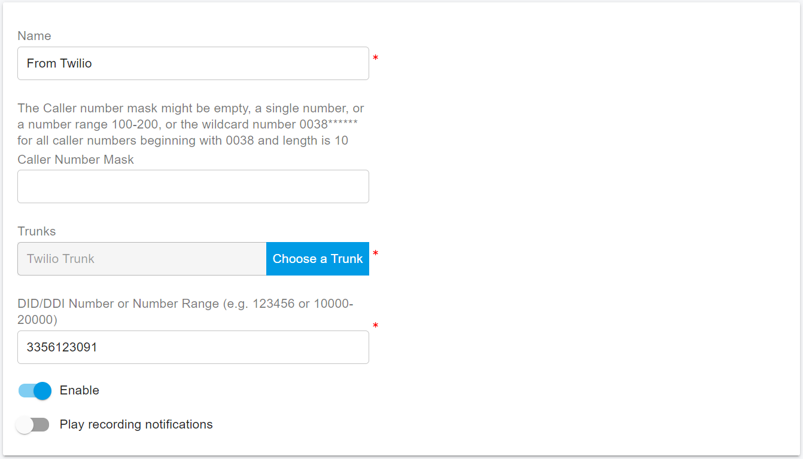
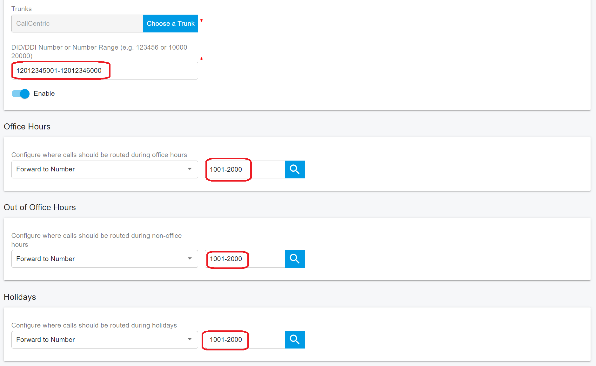
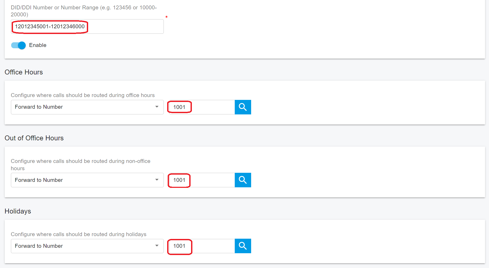
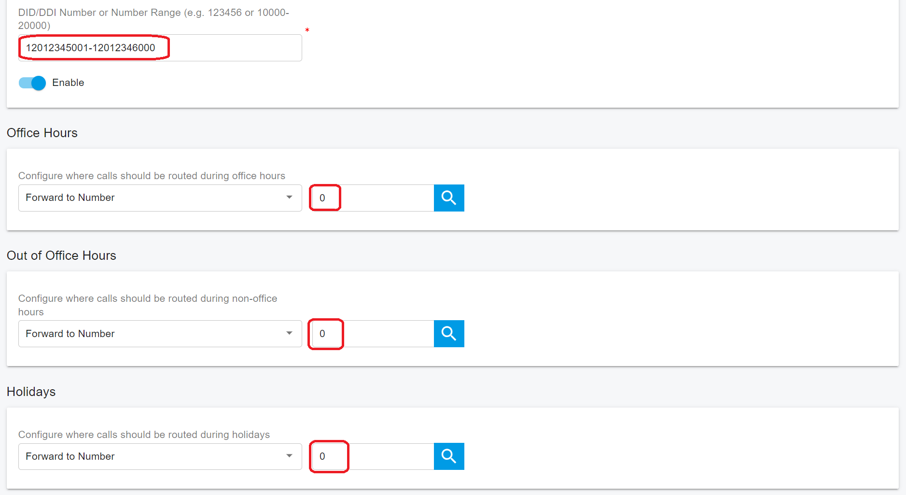

# Configuring Inbound Rule

## Creating Inbound Rules

Many companies provide users and/or departments with **Direct or DID numbers**, which allow their contacts to bypass the receptionist and make calls directly. DID numbers are also referred to as DDI numbers in the United Kingdom and MSN numbers in Germany.

Even if you make use of a virtual receptionist, a direct line or number is often preferable because it’s more convenient for the caller.

Direct dial numbers are easily implemented by using **Inbound Rules**. DID numbers is provided by your trunk provider or phone company and are virtual numbers assigned to your physical lines. Usually, you are assigned a range of numbers. Please ask your Phone Company or trunk provider for more information about DID numbers.

You have to configure at least one trunk before adding the inbound rules.

To add the inbound rule:

1. Sign in to the PortSIP PBX Web Portal by **System Admin** credentials, click the menu **Tenants**, select a tenant then click the **Manage** button to manage this tenant to configure the inbound rule. or sign a user who has  `Tenant Admin` permission into the Web Portal to manage that tenant.
2. From the Web Portal, select **Call Manager > Inbound Rules**, and click the **Add** button.
3. Enter a friendly name for the rule
4. **Caller Number Mask**: you can enter the Caller number mask here, which the PBX will use to identify the caller. You can add the number in its entirety, identify a single caller, or use the \* as a wildcard. For example, `0044**********` will identify a UK Caller and `004420********` will identify a caller from London. Note: the `*` digits must match the number actually digits. If the number is 3 digits, then should use `***`.
   * The Caller number mask also allows setting as a number range, for example `00442012345670-00442012345680`.
   * The Caller number mask can be empty, usually, we do not need to set it.
5. In the trunk box, select which SIP trunk you wish to be associated with this DID and inbound rule, it only allows assigning one SIP trunk with an inbound rule.
6. In the **DID/DDI Number Mask** field, enter the DID number as it will appear in the SIP **To** header (The number your trunk provider has been applied as your main, or first, DID number). PortSIP PBX will match the number inserted into this field with the **To** header of the `SIP INVITE` message which is trunk sent to PBX.
   * The DID number can be **1** means to match all numbers.
   * The DID number can be a single number like `442012345678`
   * The DID number can be serial number range, for example: `3325261000-3325262000`，`442012345600-442012345800` .
   * The single DID number or serial number range must be in the trunk DID pool range.
   * The DID number and DID pool cannot begin with **+**, **0**, or **00**; if your DID number or DID pool begins with **+**, **0**, or **00**, **please remove them before entering.**


Unless specified otherwise, the Caller Number Mask should typically be left empty and not set up. If both the Caller Number Mask and DID Number Mask are set, it implies the following: When an incoming call is received, if the caller’s number matches the CID and the called number matches the DID, then this inbound rule is considered a match.

On the other hand, if only the DID is set, it means that when an incoming call is received, if the called number matches the DID, then this inbound rule is considered a match.


7. Play recording notifications: When this option is enabled, any inbound calls routed to the PBX through this rule will trigger the PBX to play the voice prompt. This serves to notify the caller that the call may be recorded.

<figure><figcaption></figcaption></figure>

8. Specify how you wish to forward incoming calls according to this inbound rule.

* **Forward to number**: permits you to enter a number and then forward the call to that number; the number can be an extension number or system extension number(ring group, virtual receptionist, meeting number, queue number) or a PSTN phone number. The number can also be a range, for example: `2000-3000`. If setting the **Forward to number** field is a range, this range must be serial numbers, and the **DID Number Mask** also must be a number range and both range sizes must be equal. For example, in the **DID Number Mask** field fill in as `442012345600-442012345800` , in the **Forward to number** field set the value as `1100-1300` , if the call from the trunk is to `442012345600` , the PBX will route that call to the extension `1100` ;  if the call from the trunk is to `442012345698` , the PBX will route that call to the extension `1198` , that's 1:1 mapping.
* **Forward to voicemail**: The call will be routed to the voicemail service so the caller can leave a voice message. There is an option to select an extension number for the voicemail box. For example, if you choose extension 108, the voicemail will be saved in the 108's mailbox.
* **Hangup**: The call will be terminated by the PBX.&#x20;

9. You can specify that an incoming call should be forwarded differently if it is received outside office hours or on a holiday.
10. you can set an inbound rule to route bulk DID numbers to bulk extensions. See above point 7.

## **Office Hours and Holidays**

### Office hours

On the **Office Hours** tab of the inbound rule, you can set the office hours for the inbound rule so that the incoming calls will be routed to different destinations on the basis of the current hour.

If **Use default Global Office Hours** is selected, the PBX will use the office hours specified by the **Tenant Admin**;

If **Use specific Office Hours** is selected, customized office hours rules apply instead.

### Holidays

In the **Holidays** section, you can choose one or more holidays from the tenant's holiday list. During the holidays, the incoming call that matches this inbound rule will be routed to the **Holidays** destination of that rule. For more details please refer to the [Office Hours and Holiday Schedule](../office-hours-and-holiday-schedule/).

<figure><figcaption></figcaption></figure>

## **Language Skill Routing**

You can create multiple inbound rules based on the same DID number with a trunk, but all these inbound rules must have a different CID number mask.

### **Example**

You have the DID `00326012345670`, create two inbound rules:&#x20;

1. The Caller Number Mask for the first rule is `0044**********`, the DID number mask is `326012345670`, and the call is routed to **Queue 8000**
2. The Caller Number Mask for the second rule is `0033*********`, the DID number mask is `326012345670`, and the call is routed to **Queue 9000**.

Assign all English-speaking employees to **Queue 8000** and designate all French-speaking employees as agents for **Queue 9000**.

When callers call **00326012345670**, UK callers(their caller number starts with 0044) will be directed to **Queue 8000** to communicate with an English agent, and French callers(their caller number starts with 0033) will be routed to **Queue 9000** to engage with a French agent

## **Route Bulk Numbers to Bulk Extensions**

Assuming a huge corporation with 1,000 employees and has purchased 1,000 DID numbers from a trunk service provider, serial numbers are used in these DID numbers. If you assign a DID number to each employee, your clients can reach them by dialing their DID number. However, this is an almost hard assignment because 1,000 inbound rules must be created to route 1,000 DID numbers to 1,000 extensions (each employee is an extension).

PortSIP PBX has a great feature that allows you to implement your objective with just one inbound rule.

Assuming the DID numbers are **0012012345001-0012012346000**, and the employees' extension numbers are **1001-2000**.

1. Create an inbound rule, and set the **DID Number Mask** field to **12012345001-12012346000**.
2. Confiture the call route destination to **1001-2000**.

If someone dials **0012012345001**, the call will be routed to extension **1001**, if dials **0012012345002**, the call will be routed to extension **1002**, and if dials **0012012345005** the call will be routed to extension **1005**.

<figure><figcaption></figcaption></figure>

In the scenario above, if you want to route the DID numbers **0012012345001-0012012346000** to only one number, for example, **1001**, you can set up an inbound rule as shown in the screenshot below. If someone dials a number within the range **0012012345001-0012012346000**, the call will be routed to number **1001**.

<figure><figcaption></figcaption></figure>

## Route Calls to Any Number

In some of the scenarios, if you want to route a **single DID number** or **DID numbers range** to any number, you can set up an inbound rule with a route destination number of **0**, as shown in the screenshot below, the **0** means don't change the destination number when routing the call.

<figure><figcaption></figcaption></figure>

If someone dials a number within the range **0012012345001-0012012346000**, the call will be routed to the destination number that is the same as the dialed number in that call. The PBX doesn’t change the destination number when routing the call.

You can also set the DID number as a single number rather than the range for this routing purpose.

## Advanced Routing

In addition to office hours and holidays, you can also route inbound calls based on the year, month, day, weekday, and time to a specified destination. For more details please refer to this topic: [Advanced Routing for Inbound Rule](../office-hours-and-holiday-schedule/routing-calls-based-on-office-hours-and-holidays.md#advanced-routing-for-inbound-rule).

