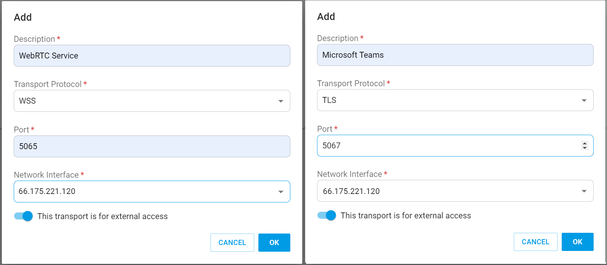

# Copy of Configuring PortSIP SBC v11.x for WebRTC

## Install the PortSIP SBC and PBX on the Same Server

The PortSIP SBC can be deployed with the PortSIP PBX on the same server. In this configuration, the PBX handles SIP calling directly, while the SBC provides WebRTC services and enables interworking for Microsoft Teams Direct Routing.

For this example, assume the following server configuration:

* **Private IP**: 192.168.1.72
* **Public IP**: 66.175.221.120
* The domain **uc.portsip.cc** is resolved to the public IP address **66.175.221.120**.
* A trusted SSL certificate(not self-signed) is installed for the domain **uc.portsip.cc**.

Before proceeding, please review the following sections carefully:

### Supported OS

* Debian 11.x, 12.x
* Ubuntu 22.04, 24.04
* Windows 10 1903/19H1 or higher, Windows 11
* Windows Server 2022 or higher

### Preparing the Server for Installation <a href="#preparing-the-server-for-installation" id="preparing-the-server-for-installation"></a>

Tasks that MUST be completed before installing PortSIP PBX

* **Ensure the server date-time is synced correctly**.
* For the Linux, use the `sudo` to perform the installation is recommended. For Windows, it requires the Administrator user.
* If the server on which SBC will be installed is located on a LAN, assign &#x61;**`static private IP address`**&#x74;o the PBX server; if it's on a public network, assign &#x61;**`static public IP address`** and a **`static private IP`** to the PBX server.
* Install all available updates and service packs before installing PortSIP SBC.
* Do not install **PostgreSQL** on your PortSIP SBC Server.
* Ensure that all power-saving options for your system and network adapters are disabled (by setting the system to High-Performance mode).
* Do not install TeamViewer, VPN, or other similar software on the host machine.
* The PortSIP SBC must not be installed on a host that is a DNS or DHCP server.
* The below ports must be permitted by your firewall(these ports are required by the PortSIP SBC).
  * UDP: 5066, 25000-34999
  * TCP: 5065, 5067, 10443. please also ensure the above ports have not been used by other applications.
* If installed on Windows, ensure the **`Windows Firewall`** service has been started.


If the PBX runs on a cloud platform such as AWS and the cloud platform has its own firewall, you **must** also open the ports on the cloud platform's firewall.


### Prepare SSL Certificate

Please follow the article [Certificates for TLS/HTTPS/WebRTC](../../certificates-for-tls-https-webrtc/) to prepare the certificates.

Assume that you have successfully installed the PortSIP PBX following the instructions in the [Installation of the PortSIP PBX](../../1-installation-of-the-portsip-pbx.md) guide.


All commands must be executed in the **`/opt/portsip`** directory.


### Install PortSIP SBC for Linux

To install the SBC, please follow the steps below:

* Execute the below commands to download the SBC installation scripts.

```shell
mkdir -p /opt/portsip
sudo cd /opt/portsip
```

```bash
sudo curl \
https://raw.githubusercontent.com/portsip/portsip-pbx-sh/master/v22.x/init.sh  \
-o  init.sh
```

```bash
sudo /bin/sh init.sh
```

* Execute the below command to install the `Docker-Compose` environment.  If get the prompt like`*** cloud.cfg (Y/I/N/O/D/Z) [default=N] ?`, enter the **Y** and then press the **Enter** button.

```bash
/bin/sh install_docker.sh
```

* The below command is used to create and run the SBC on the server.

```shell
/bin/sh sbc_ctl.sh run -p /var/lib/portsip -i portsip/sbc:10
```

#### Install PortSIP SBC for Windows

You can download the PortSIP SBC installer at [PortSIP Website](https://www.portsip.com/download-portsip-sbc/), just double click the installer and follow the instructions to install it.

### Configure the PortSIP SBC

1. Prepare the SSL certificate as the guide [TLS Certificates for TLS/HTTPS/WebRTC](../../certificates-for-tls-https-webrtc/).
2. Go to [https://uc.portsip.cc:8883](https://uc.portsip.io:8883) in the browser and log in using the credentials`admin/admin`. If the browser displays the SSL certificate warning, ignore the warning and continue processing.
3. Choose **Settings > TLS Certificates** from the menu, click **Add** button, and enter "**SBC Host Name**" for the **Description** field as an example; enter`uc.portsip.cc` for the **TLS Domain**. Open the **portsip.pem** file in Windows Notepad and copy the contents into the **Certificate Context** field. Copy and paste the contents of the **portsip.key** file into the **Private Key Context** field, and turn on the option **This is SBC Web Domain Certificate**. Click the **OK** button to save the certificates.
4. Select **Settings > Network** from the menu, then fill in the field **Web Domain** with `uc.portsip.cc`, **Private IPv4** with`192.168.1.72`, and Public IPv4 with `66.175.221.120`. By default, the **Create default transports automatically** option is turned on, and the SBC will create the default transports after successfully setting up the SBC IP address. We suggest keeping this turned on to create the default transports.
5.  Default transports:

    * &#x20;`TCP on port 5069` : it's used to communicate with PBX
    * &#x20;`TLS on port 5067` : it's used to communicate with Microsoft Teams
    * &#x20;`WSS on the port 5065` : it's used to provide the WebRTC service.&#x20;
    * `UDP on the port 5066`: it's used to provide the normal SIP service.&#x20;

    You can turn off this option to prevent the SBC from automatically creating default transports, **but this is not recommended**.
6. When you click the **OK** button, SBC will restart automatically and immediately sign you out.
7.  Execute the below commands on the server. If the server is Windows, just restart the server directly.

    ```shell
    /bin/sh sbc_ctl.sh restart
    ```
8. Sign in to the PBX web portal [https://uc.portsip.cc:8887](https://uc.portsip.io:8887), and click the menu **Advanced > SBC**. Click the **Generate** button to generate the token for the SBC's access. Click the **Copy** button to copy the token.
9. Sign in to the PortSIP SBC Web Portal [https://uc.portsip.cc:8883](https://uc.portsip.io:8883). Choose **Settings > PBX** from the menu. You have to set up the PBX information here then the SBC will communicate with the PBX. Paste the copied token to the **PBX Access Token** field, and enter the PBX private IP `192.168.1.72` for the **PBX IPv4 Address** field. Since the TCP transport is created on port **5063** in the PBX, please choose the **TCP** for **Prefer to transport to communicate with PBX**, and enter "**5063**" for **PBX Port**.&#x20;
10. Choose **Settings > Transports** from the menu. The SBC requires adding three types of transport here. One is for the WebRTC clients, one for Microsoft Teams, and one for the SBC to communicate with the PBX. After the above **step 4** is completed with the **Create default transports automatically** option enabled, the SBC will create the default transport automatically. **These default transports aren't recommended to be changed.**
11. **This step is unnecessary if you keep using the default transport**. If you wish to create your own transport, you can delete the existing transport.
    * Add the **TCP** transport for SBC to communicate with the PBX, please refer to the below screenshot, and choose the **SBC private IP** for the **Network Interface**.
    * Add the **WSS** transport for WebRTC clients as in the below screenshot, please choose the **SBC public IP** for the **Network Interface**.
    * Add the **TLS** transport for the SBC to communicate with Microsoft Teams as in the below screenshot, please choose the **SBC public IP** for the **Network Interface**.
    * Add a **UDP** transport for the SBC to provide the normal SIP service as in the below screenshot, please choose the **SBC public IP** for the **Network Interface**.

<figure><figcaption></figcaption></figure>

<figure><figcaption></figcaption></figure>

&#x20;12\. If you created your own transport in **step 11** rather than using the default transport, please open the ports of your transport on the firewall with the below commands. For example, if you create a **UDP** transport on port **5066**, **TCP** transport on port **5069**, **TLS** transport on port **5067**, and **WSS** transport on port **5065**, please execute the below commands.

```bash
firewall-cmd --permanent --service=portsip-sbc --add-port=5066/udp --set-description="PortSIP SBC"
firewall-cmd --permanent --service=portsip-sbc --add-port=5065/tcp --set-description="PortSIP SBC"
firewall-cmd --permanent --service=portsip-sbc --add-port=5067/tcp --set-description="PortSIP SBC"
firewall-cmd --permanent --service=portsip-sbc --add-port=5069/tcp --set-description="PortSIP SBC"
firewall-cmd --reload
```

&#x20;13\. Open the URL [https://uc.portsip.cc:10443/webrtc](https://uc.portsip.cc:10443/webrtc) in the browser, and the WebRTC client will be launched. Just enter the extension number, password, and the tenant SIP domain to register to PBX to make & receive calls.


Once added a new transport, you have to change the firewall rule to allow that transport port. The client app, IP Phone will reach PBX by transport and port.


## Install the PortSIP SBC and PBX on separate servers

Typically, PortSIP SBC is deployed on a separate server from the PortSIP PBX, the SBC sits in front and the PBX is transparent to the end users.

Assuming we want to install the PortSIP PBX and SBC with the following configurations:

* The PBX server's private IP is **192.168.1.72**.
* The SBC server's private IP is **192.168.1.73**, and the public IP is **66.175.221.120**
* The domain `sbc.portsip.cc` has been resolved to the SBC server public IP of **66.175.221.120**.
* The domain `uc.portsip.cc` has been resolved to the PBX server **192.168.1.72**, this step is not necessary.
* A trusted **Wildcard SSL certificate** for the domain `portsip.cc`

Please read the [Supported Linux OS](https://support.portsip.com/portsip-pbx-user-guide/portsip-pbx-administration-guide-v16.x/1-installation-of-the-portsip-pbx#supported-linux-os), [Preparing the Linux Host Machine for Installation](https://support.portsip.com/portsip-pbx-user-guide/portsip-pbx-administration-guide-v16.x/1-installation-of-the-portsip-pbx#preparing-the-linux-host-machine-for-installation), and [TLS Certificates for TLS/HTTPS/WebRTC](../../certificates-for-tls-https-webrtc/) carefully.

### Install PortSIP PBX and SBC

Assume the PBX has been installed as the [1 Installation of the PortSIP PBX](broken-reference).

#### Install PortSIP SBC for Linux

In the SBC server, to install the SBC, please follow the below steps.

* Execute the below commands to download the SBC installation scripts.


All commands must be executed in the **`/opt/portsip`** directory.



You must use the su - rather than su root


```shell
sudo -
mkdir -p /opt/portsip
cd /opt/portsip
```

```bash
curl https://raw.githubusercontent.com/portsip/portsip-pbx-sh/master/v16.x/install_sbc_docker.sh \
-o install_sbc_docker.sh
```

```bash
curl https://raw.githubusercontent.com/portsip/portsip-pbx-sh/master/v16.x/sbc_ctl.sh \
-o sbc_ctl.sh
```

* Execute the below command to install the `Docker-Compose` environment.  If get the prompt like`*** cloud.cfg (Y/I/N/O/D/Z) [default=N] ?`, enter the **Y** and then press the **Enter** button.

```bash
/bin/sh install_sbc_docker.sh
```

* The below command is used to create and run the SBC on the PBX server.

```shell
/bin/sh sbc_ctl.sh run -p /var/lib/portsip -i portsip/sbc:10
```

#### Install PortSIP SBC for Windows

You can download the PortSIP SBC installer at [PortSIP Website](https://www.portsip.com/download-portsip-sbc/), just double click the installer and follow the instructions to install it.

### Configure the PortSIP SBC

1. Prepare a **wildcard SSL certificate** as the guide [Preparing SSL Certificates for TLS/HTTPS/WebRTC](../../certificates-for-tls-https-webrtc/).
2. Go to [https://sbc.portsip.cc:8883](https://sbc.portsip.io:8883) in the browser and log in using the credentials`admin/admin`. If the browser displays the SSL certificate warning, ignore the warning and continue processing.
3. Choose **Settings > TLS Certificates** from the menu, click the **Add** button, and type "**SBC Host Name"** for the **Description** field as an example; enter `portsip.cc` for the **TLS Domain**. Open the **portsip.pem** file in Windows Notepad and copy the contents into the **Certificate Context** field. Copy and paste the contents of the **portsip.key** file into the **Private Key Context** field, and turn on the option **This is SBC Web Domain Certificate**. Click the **OK** button to save the certificates.
4. Select **Settings > Network** from the menu, then fill in the field **Web Domain** with `portsip.cc`, **Private IPv4** with`192.168.1.73`, and Public IPv4 with `66.175.221.120`. By default, the **Create default transports automatically** option is turned on, and the SBC will create the default transports after successfully setting up the SBC IP address.&#x20;
5.  Default transports:

    * &#x20;`TCP on port 5069` : it's used to communicate with PBX
    * &#x20;`TLS on port 5067` : it's used to communicate with Microsoft Teams
    * &#x20;`WSS on the port 5065` : it's used to provide the WebRTC service.&#x20;
    * `UDP on the port 5066`: it's used to provide the normal SIP service.&#x20;

    You can turn off this option to prevent the SBC from automatically creating default transports, **but this is not recommended**.
6. When you click the **OK** button, SBC will restart automatically and immediately sign you out.
7.  Execute the below commands on the SBC server.  If the server is Windows, just restart the server directly.

    ```shell
    /bin/sh sbc_ctl.sh restart
    ```
8. Sign in to the PBX web portal, [https://uc.portsip.cc:8887](https://uc.portsip.io:8887), and click the menu **Advanced > SBC**. Click the **Generate** button to generate the token for the SBC's access. Click the **Copy** button to copy the token.
9. Sign in to the PortSIP SBC Web Portal [https://uc.portsip.cc:8883](https://uc.portsip.io:8883). Choose **Settings > PBX** from the menu. You have to set up the PBX information here then the SBC will communicate with the PBX. Paste the copied token to the **PBX Access Token** field, and enter the PBX private IP `192.168.1.72` for the **PBX IPv4 Address** field. Since the TCP transport is created on port 5063 in the PBX, please choose the **TCP** for **Prefer to transport to communicate with PBX**, and enter **5063** for **PBX Port**.
10. **This step is unnecessary if you keep using the default transport**. If you wish to create your own transport, you can delete the existing transport.
    * Add the **WSS** transport for WebRTC clients as in the below screenshot, please choose the **SBC public IP** for the **Network Interface**.
    * Add the **TLS** transport for the SBC to communicate with Microsoft Teams as in the below screenshot, please choose the **SBC public IP** for the **Network Interface**.
    * Add a **UDP** transport for the SBC to provide the normal SIP service as in the below screenshot, please choose the **SBC public IP** for the **Network Interface**.
    * Add the **TCP** transport for SBC to communicate with the PBX, please refer to the below screenshot, and choose the **SBC private IP** for the **Network Interface**;&#x20;
11. Choose **Settings > Transports** from the menu. The SBC requires adding three types of transport here. One is for the WebRTC clients, one for Microsoft Teams, and one for the SBC to communicate with the PBX. After the above **step 4** is completed with the **Create default transports automatically** option on, the SBC will create the default transport automatically. **These default transports aren't recommended to be changed.**

<figure><figcaption></figcaption></figure>

<figure><figcaption></figcaption></figure>

12. &#x20;If you created your own transport in **step 9** rather than using the default transport, please open the ports of your transport on the firewall with the below commands. For example, if you create a **UDP** transport on port **5066**, **TCP** transport on port **5069**, **TLS** transport on port **5067**, and **WSS** transport on port **5065**, please execute the below commands.&#x20;

```
firewall-cmd --permanent --service=portsip-sbc --add-port=5066/udp --set-description="PortSIP SBC"
firewall-cmd --permanent --service=portsip-sbc --add-port=5067/tcp --set-description="PortSIP SBC"
firewall-cmd --permanent --service=portsip-sbc --add-port=5069/tcp --set-description="PortSIP SBC"
firewall-cmd --permanent --service=portsip-sbc --add-port=5065/tcp --set-description="PortSIP SBC"
firewall-cmd --reload
```

13. &#x20;Open the URL [https://uc.portsip.cc:10443/webrtc](https://uc.portsip.cc:10443/webrtc) in the browser, and the WebRTC client will be launched. Just enter the extension number, password, and the tenant SIP domain to register to PBX to make & receive calls.

After successfully creating the SBC docker instance, you can use the below commands to manage it.

#### Display the SBC Docker Instance Status.

```bash
/bin/sh sbc_ctl.sh status
```

#### Start the SBC Docker Instance.

```bash
/bin/sh sbc_ctl.sh start
```

#### Stop the SBC Docker Instance.

```bash
/bin/sh sbc_ctl.sh stop
```

#### Restart the SBC Docker Instance.

```bash
/bin/sh sbc_ctl.sh restart
```

#### Delete the SBC Docker Instance.

```bash
/bin/sh sbc_ctl.sh rm
```

### Add the SBC IP address to the PBX whitelist

To prevent the PBX from limiting the request rate, we need to add the SBC IP to the whitelist in the PBX.&#x20;

To do this, sign in as the System Administrator and select the menu **IP Blacklist** > **Add**. Then enter the SBC IP as shown in the screenshot below and choose a long **expiration date.**

<figure><figcaption></figcaption></figure>

### Check opened firewall ports

The below commands are used to check currently opened ports for PortSIP SBC.

```sh
firewall-cmd --info-service=portsip-sbc
```

