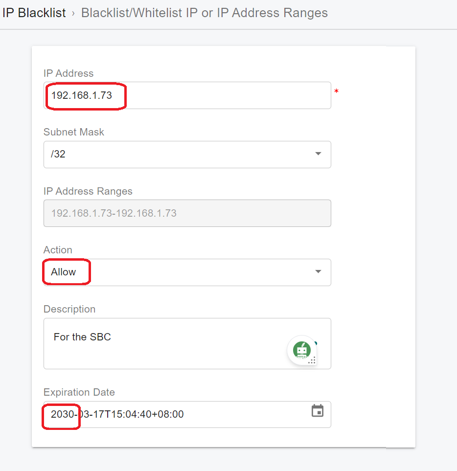

# Configuring PortSIP SBC for WebRTC

After successfully installing the PortSIP SBC following the guide, you can now configure the SBC for the WebRTC feature.

## Configure PortSIP SBC on the Same Server as PortSIP PBX

If you installed the PortSIP SBC on the _**same server as the PortSIP PBX**_, please follow the below steps to configure it.

1. Prepare the SSL certificate as outlined in the guide for [TLS Certificates for TLS/HTTPS/WebRTC](../../certificates-for-tls-https-webrtc/), You will have the `portsip.pem`  `portsip.key` files.
2. Open `https://66.175.221.120:8883` in the browser and log in using the credentials `admin/admin`. Just ignore the browser SSL certificate warning and continue processing.
3.  Choose **Settings > TLS Certificates** from the menu, click the **Add** button:

    1. Enter `"SBC Host Name"` for the **Description** field as an example.
    2. Enter `uc.portsip.cc` for the **TLS Domain.**
    3. Open the `portsip.pem` file in Windows Notepad and copy its contents into the **Certificate Context** field.&#x20;
    4. Copy and paste the contents of the `portsip.key` file into the **Private Key Context** field.
    5. Turn on the option **This is SBC Web Domain Certificate**.&#x20;

    Click **OK** to save the certificate.
4.  Select **Settings > Network** from the menu, fill in the following fields:&#x20;

    1. **Web Domain** with `uc.portsip.cc`
    2. &#x20;**Private IPv4** with `192.168.1.72`,&#x20;
    3. **Public IPv4** with `66.175.221.120`.&#x20;

    By default, the **Create default transports automatically** option is turned on, and the SBC will create the default transports after successfully setting up the SBC IP address. Please keep this option enabled to create the default transports.
5. The SBC will create the default transports as the below:
   * **TCP on port 5069**: Used to communicate with PBX
   * **TLS on port 5067**: Used to communicate with Microsoft Teams
   * **WSS on port 5065**: Provides WebRTC service
   * **UDP on port 5066**: Provides standard SIP service\
     You can turn off the **Create default transports automatically** option to prevent the SBC from automatically creating the default transports, _**but this is not recommended**_.
6. When you click **OK**, the SBC will restart automatically and immediately log you out.
7.  Execute the following commands to restart the PBX server:

    1. `cd /opt/portsip`
    2. ⁣`sudo /bin/shsh sbc_ctl.sh restart`&#x20;

    If the server is Windows, simply restart the server directly.
8. Sign in to the PBX web portal at `https://uc.portsip.cc:8887`&#x20;
   1. Navigate to the **Advanced > SBC** menu.&#x20;
   2. Click the **Generate** button to generate the token for the SBC's access.&#x20;
   3. Click the **Copy** button to copy the token.
9. Sign in to the SBC Web Portal at `https://uc.portsip.cc:8883`
   1. Choose **Settings > PBX** from the menu. You need to set up the PBX information here for the SBC to communicate with the PBX.&#x20;
   2. Paste the copied token into the **PBX Access Token** field,&#x20;
   3. Enter `192.168.1.72` for the **PBX IPv4 Address** field.&#x20;
   4. Since the TCP transport is created on port 5063 in the PBX, select **TCP** for **Prefer Transport** to communicate with the PBX
   5. Enter `"5063"` for the **PBX Port**.
10. Open the URL `https://uc.portsip.cc:10443/webrtc` in your browser, and the WebRTC client will launch. You can scan the user's QR code to register with the PBX and make/receive calls.

## Configure PortSIP SBC on a Separate Server

If you installed the PortSIP SBC on _**a separate server from the PortSIP PBX**_, please follow the below steps to configure it.

1. Prepare the SSL certificate as outlined in the guide for [TLS Certificates for TLS/HTTPS/WebRTC](../../certificates-for-tls-https-webrtc/), You will have the `portsip.pem`  `portsip.key` files.
2. Open `https://66.175.221.120:8883` in the browser and log in using the credentials `admin/admin`. Just ignore the browser SSL certificate warning and continue processing.
3.  Choose **Settings > TLS Certificates** from the menu, click the **Add** button:

    1. Enter `"SBC Host Name"` for the **Description** field as an example.
    2. Enter `sbc.portsip.cc` for the **TLS Domain.**
    3. Open the `portsip.pem` file in Windows Notepad and copy its contents into the **Certificate Context** field.&#x20;
    4. Copy and paste the contents of the `portsip.key` file into the **Private Key Context** field.
    5. Turn on the option **This is SBC Web Domain Certificate**.&#x20;

    Click **OK** to save the certificate.
4.  Select **Settings > Network** from the menu, fill in the following fields:&#x20;

    1. **Web Domain** with `sbc.portsip.cc`
    2. &#x20;**Private IPv4** with `192.168.1.73`,&#x20;
    3. **Public IPv4** with `66.175.221.120`.&#x20;

    By default, the **Create default transports automatically** option is turned on, and the SBC will create the default transports after successfully setting up the SBC IP address. Please keep this option enabled to create the default transports.
5. The SBC will create the default transports as the below:
   * **TCP on port 5069**: Used to communicate with PBX
   * **TLS on port 5067**: Used to communicate with Microsoft Teams
   * **WSS on port 5065**: Provides WebRTC service
   * **UDP on port 5066**: Provides standard SIP service\
     You can turn off the **Create default transports automatically** option to prevent the SBC from automatically creating the default transports, _**but this is not recommended**_.
6. When you click **OK**, the SBC will restart automatically and immediately log you out.
7.  Execute the following commands to restart the PBX server:

    1. `cd /opt/portsip`
    2. ⁣`sudo /bin/shsh sbc_ctl.sh restart`&#x20;

    If the server is Windows, simply restart the server directly.
8. Sign in to the PBX web portal at `https://uc.portsip.cc:8887`&#x20;
   1. Navigate to the **Advanced > SBC** menu.&#x20;
   2. Click the **Generate** button to generate the token for the SBC's access.&#x20;
   3. Click the **Copy** button to copy the token.
9. Sign in to the SBC Web Portal at `https://sbc.portsip.cc:8883`
   1. Choose **Settings > PBX** from the menu. You need to set up the PBX information here for the SBC to communicate with the PBX.&#x20;
   2. Paste the copied token into the **PBX Access Token** field,&#x20;
   3. Enter `192.168.1.72` for the **PBX IPv4 Address** field.&#x20;
   4. Since the TCP transport is created on port 5063 in the PBX, select **TCP** for **Prefer Transport** to communicate with the PBX
   5. Enter `"5063"` for the **PBX Port**.
10. Open the URL `https://sbc.portsip.cc:10443/webrtc` in your browser, and the WebRTC client will launch. You can scan the user's QR code to register with the PBX and make/receive calls.

### Add the SBC IP address to the PBX whitelist

To prevent the PBX from limiting the request rate, you need to add the SBC IP address to the whitelist in the PBX.

1. Sign in to the PBX as the **System Administrator**.
2. Navigate to the **IP Blacklist** menu and click **Add**.
3. Enter the SBC IP address, as shown in the screenshot below.
4. Set a long expiration date for the entry to ensure it remains valid for an extended period.

<figure><figcaption></figcaption></figure>

## Check opened firewall ports

The below commands are used to check currently opened ports for PortSIP SBC.

```sh
firewall-cmd --info-service=portsip-sbc
```

