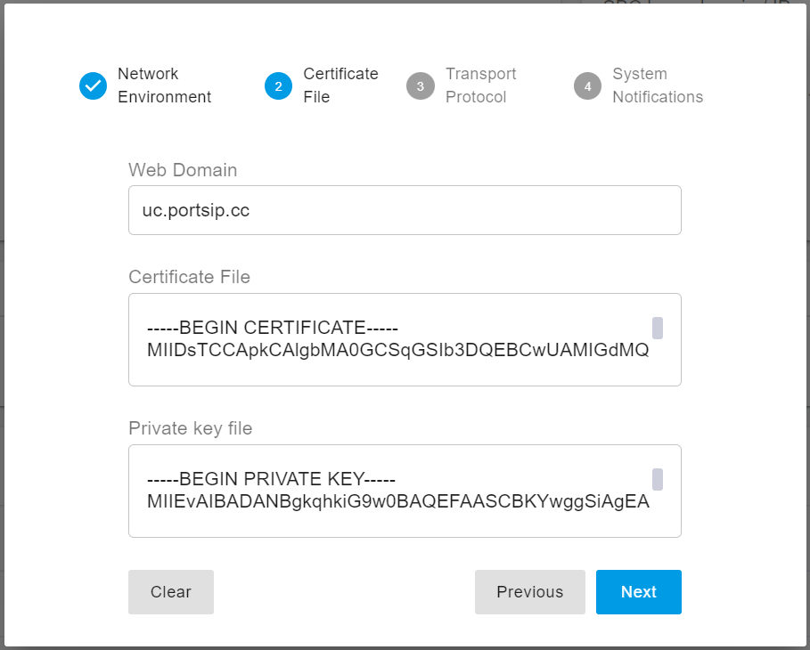
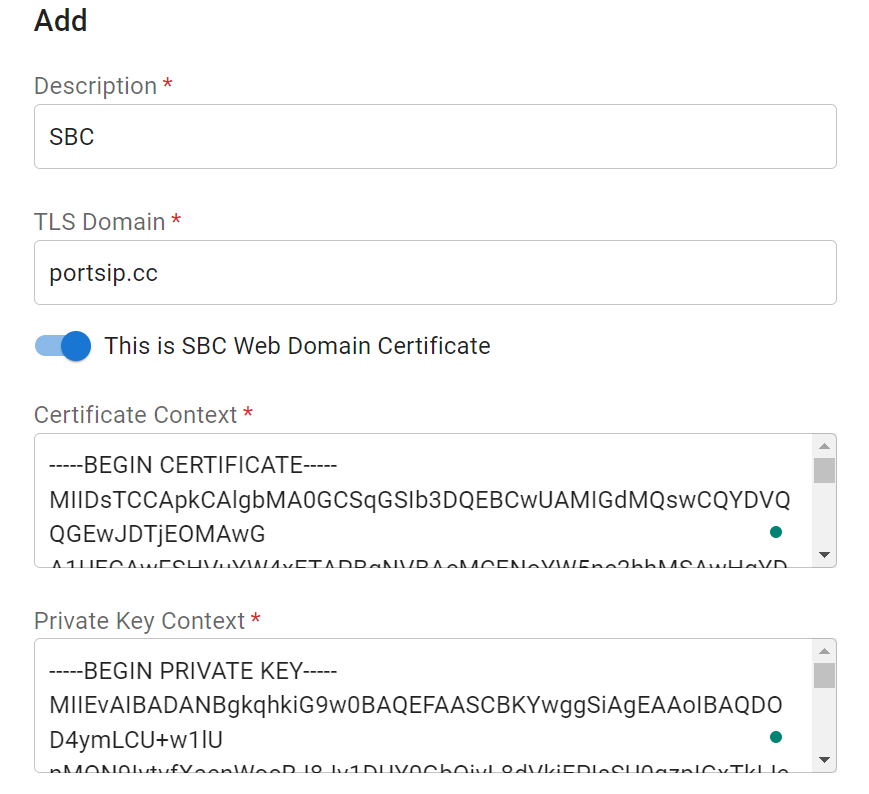

# Update Certificates

## Prerequisite

Before updating the certificates for the PBX and SBC, please make sure that you have completed the setup and configuration of the PBX and SBC according to the following guides.

[Installation of the PortSIP PBX](../installation-of-the-portsip-pbx-beta.md).

[Configuring the PortSIP PBX](../2-configuring-the-portsip-pbx.md).

[Configuring SBC for WebRTC](../9-configuring-sbc-for-webrtc.md).

After completing the [Preparing TLS Certificates](preparing-tls-certificates.md) step, you will have the `portsip.pem` and `portsip.key` files. You can use these files to update the certificates for the PortSIP PBX and PortSIP SBC.

In this article, we assume that the domain `uc.portsip.cc` is resolved to the IP address of the PBX server and that `sbc.portsip.cc` is resolved to the IP address of the SBC server.

## Update Certificates for PBX

### Updating Certificates

To update the certificates for the PortSIP PBX, please follow these steps:

1. Sign in to the PBX Web Portal as the system administrator.
2. Click the **Setup Wizard** button on the home page.
3. Click the **Clear** button in step 2 of the Setup Wizard.
4. Enter your PBX web domain into the **Web Domain** field. Note that you do not need to include the `https` or `www.` prefixes, just enter the domain itself. For example, `uc.portsip.cc`.
5. Open the `portsip.pem` file by Windows Notepad, copy all of its contents and paste them into the **Certificate File** field.
6. Open the `portsip.key` file by Windows Notepad, copy all of its contents and paste them into the **Private Key File** field.
7. Click the `Next` button to complete the **Setup Wizard** and save the certificates.

<figure><figcaption></figcaption></figure>

### Restarting Service

To apply the changes to the certificates, open an SSH connection to the server and execute the following commands for Linux.

```
cd /opt/portsip
/bin/sh pbx_ctl.sh restart
```

For Windows, just restart the server directly.


If your browser still displays an icon indicating that the site is not secure, please try opening the web portal in a new browser tab. This should resolve the issue and display the sites correctly.


## Update Certificates for SBC

### Updating Certificate

To update the certificates for the PortSIP SBC, please follow these steps:

1. Sign in to the SBC Web Portal as the system administrator.
2. Select the **TLS Certificates** menu.
3. If there is already a TLS certificate for your SBC domain, please delete it by clicking the delete icon.
4. Click the **Add** button to add a new TLS certificate. If your certificate is a wildcard certificate for the `portsip.cc` domain, you will just need to enter `portsip.cc` in the T**LS Domain** field. If your certificate is not a wildcard and is only for a single domain, such as `sbc.portsip.cc`, then you will need to enter `sbc.portsip.cc` in the **TLS Domain** field.
5. The **This is SBC Web Domain Certificate** option should be turned on unless you are sure that this domain is only for SIP TLS transport.
6. Open the `portsip.pem` file by Windows Notepad, copy all of its contents and paste them into the **Certificate Contents** field.
7. Open the `portsip.key` file by Windows Notepad, copy all of its contents and paste them into the **Private Contents** field.

<figure><figcaption></figcaption></figure>

8. Click the **OK** button to save the certificates. Then, select the **Network** menu, enter `sbc.portsip.cc` in the **Web Domain** field, and click the **OK** button to save your changes.

### Restarting Services

To apply the changes to the certificates, open an SSH connection to the server and execute the following commands for Linux.

```
cd /opt/portsip
/bin/sh sbc_ctl.sh restart
```

For Windows, just restart the server directly.


If your browser still displays an icon indicating that the site is not secure, please try opening the web portal in a new browser tab. This should resolve the issue and display the sites correctly.



