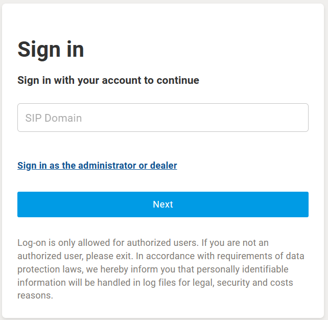
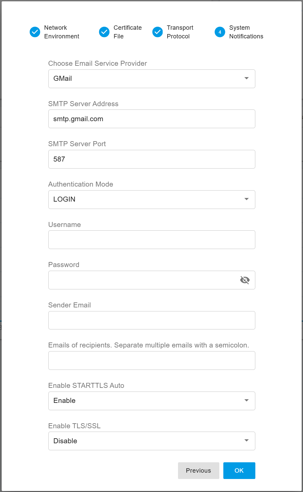

# Installation of the PortSIP PBX Beta Version

## Important Notes Before You Begin

* **Beta Stage:** Version 22.0 is currently in its beta phase. It is not recommended for use in a production environment.
* **Operating System Compatibility:** The beta version is only available for Linux. We recommend using Debian 11/12 or Ubuntu 22.04/24.04.
* **Fresh Installation Required:** Since this is a beta release, it cannot be seamlessly upgraded from the current v16.x installation. You will need to perform a fresh installation on a new server.
* **No Backward Compatibility:** Beta versions do not support backward compatibility. This means that if you want to install a new beta version, you will need to uninstall and delete the previous beta version.
* **Future Upgrades:** Once the v22.0 is officially released, it will support seamless upgrades from v16.x installations.


The beta version is intended for testing purposes only and should not be used in a production environment. We do not guarantee the stability of features or the integrity of data in this beta release.


## Supported Linux OS

The PortSIP PBX only supports the following 64-bit Linux OS:

* Ubuntu 22.04, 24.04
* Debian 11.x, 12.x

## Minimal Hardware Requirements

The PortSIP PBX requires a minimum of 2 CPU cores, 4GB of memory, and 30GB of storage. With this configuration, and without enabling call recording, the system can support up to 1,000 online users and handle 300–400 simultaneous calls.

## Preparing the Linux Host Machine for Installation

Tasks that MUST be completed before installing PortSIP PBX

* **Ensure the server date-time is synced correctly**.
* Use the `sudo` to perform the installation is recommended.
* If the Linux on which PBX will be installed is located on a LAN, assign a**`static private IP address`**to the PBX server; if it's on a public network, assign a**`static public IP address`** and a **`static private IP`** to the PBX server.&#x20;
* Install all available updates and service packs before installing PortSIP PBX.
* Do not install **PostgreSQL** on your PortSIP PBX Server.
* Ensure that all power-saving options for your system and network adapters are disabled (by setting the system to High-Performance mode).
* Do not install TeamViewer, VPN, or other similar software on the host machine.
* The PortSIP PBX must not be installed on a host that is a DNS or DHCP server.
* The below ports must be permitted by your firewall.
  * UDP: 5060, 5066, 25000-34999, 45000–65000
  * TCP: 5061, 5063, 5065, 5067, 8882, 8883, 8887, 8888, 8889, 10443. please also ensure the above ports have not been used by other applications.


If the PBX runs on a cloud platform such as AWS and the cloud platform has its own firewall, you **must** also open the ports on the cloud platform's firewall.


## Step 1: Download the  Installation Scripts


All commands must be executed in the **`/opt/portsip`** directory.


Perform the below commands to download the installation scripts and initialize the environment:


```shell
sudo curl \
https://raw.githubusercontent.com/portsip/portsip-pbx-sh/master/v22.x/init.sh  \
-o  init.sh
```


```shell
sudo /bin/sh init.sh
```

## Step 2: Setup the Docker Environment

Execute the below command to install the `Docker-Compose` environment. If you get the prompt likes`*** cloud.cfg (Y/I/N/O/D/Z) [default=N] ?`, enter the **Y** and then press the **Enter** button.

<pre class="language-shell"><code class="lang-shell"><strong>sudo /bin/sh install_docker.sh
</strong></code></pre>

## Step 3: Create and Run the PortSIP PBX Docker Container Instance

The following command is used to create and run the PBX on a server with the public IP address **66.175.221.120**. If you are running the PBX on a local area network (LAN) without a public IP address, simply replace **66.175.221.120** with the PBX server’s private LAN IP address.


If your PBX server has a public IP, you must use it in the below command for the `-a` parameter. If not, the PBX won’t work with the internet trunk.


```shell
sudo /bin/sh pbx_ctl.sh \
run -p /var/lib/portsip \
-a 66.175.221.120 \
-i portsip/pbx:22.0.30.1278-beta
```

* **-p**: Specifies the path for storing PBX data.
* **-a**: Specifies the PBX server's IP address.
* **-i**: Specifies the PBX Docker image version.

In the example above, **22.0.30.1258-beta** refers to the beta version you want to install. You can check for the latest beta version on the [Docker Hub](https://hub.docker.com/r/portsip/pbx/tags) page.

After successfully installing the PortSIP PBX beta version, you can access the PBX Web portal by visiting: [**https://66.175.221.120:8887**](https://66.175.221.120:8887)

The default system administrator username and password are both **admin**.

## Step 4: Configure the PortSIP PBX

Once the PortSIP PBX is successfully installed, you can access the web portal by opening your browser and navigating to [**https://66.175.221.120:8887**](https://66.175.221.120:8887). If your browser displays an SSL certificate warning, you can safely ignore it and continue. You will then be directed to the login page, as shown in the screenshot below.

<figure><figcaption></figcaption></figure>

Click on **"Sign in as the administrator or dealer"** to navigate to the administrator login page, as shown in the screenshot below. Enter **admin** as both the username and password to log in to the web portal.

<figure><figcaption></figcaption></figure>


Please change the default password of the admin after you log in.


After successfully logging into the PBX Web Portal, the dashboard will appear as shown in the screenshot below.

<figure><figcaption></figcaption></figure>

With a new installation, the PBX will launch a setup wizard to guide you through completing the mandatory settings.

### 1. Network Environment

* **Public IPv4 Address:**\
  If the PBX server has a static public IP address, enter it in the **Public IPv4** field. If the server does not have a static public IP, leave this field blank.
* **Private IPv4 Address:**\
  You must enter the server's private IPv4 address. If the server does not have a private IP, use the public IP address instead.

These IP addresses must be accessible to your SIP clients, as the IP entered here will function as the SIP server IP for the PBX. This is crucial when a SIP client or IP phone registers to PortSIP PBX, and should be configured as the **Outbound Proxy Server**.

* **Cloud Deployment:**\
  If the PBX is deployed in the cloud, both **Private IPv4** and **Public IPv4** addresses must be entered.
* **LAN Deployment:**\
  If the PBX is on a local network (LAN), only the **Private IPv4** address is required.


The loopback interface (127.0.0.1) is unacceptable for the private IP. Only the static IP for the LAN where the PBX is located is allowed (do not use DHCP dynamic IP).&#x20;


<figure><figcaption></figcaption></figure>

### 2. SSL Certificate

To enable **TLS** transport for SIP and secure **HTTPS** access to the Web Portal and REST API, a trusted SSL certificate must be uploaded during this step.

* **Domain Setup:**\
  You will need a web domain. For example, you can purchase a domain from providers like GoDaddy and point it to your PBX’s IP address.
* **SSL Certificate:**\
  A trusted SSL certificate is necessary to avoid browser warnings. Recommended certificate providers include **DigiCert**, **GeoTrust**, **GoDaddy**, and others.
  * If you do not have a domain or SSL certificate, you can use your PBX’s IP address as the **Web Domain** and proceed with the default certificate. However, please note that PortSIP PBX uses a self-signed certificate by default, which will trigger most browsers to block the connection and display a security warning.
* **Certificate Providers:**\
  To purchase an SSL certificate, follow the guide: [Preparing TLS Certificates for TLS/HTTPS/WebRTC](certificates-for-tls-https-webrtc/).

You will need two certificate files:

* **portsip.key**
* **portsip.pem**

**Configuring the Certificates:**

1. In the **Web Domain** field, enter **uc.portsip.cc**.
2. Open the **portsip.pem** file in a text editor (such as Windows Notepad), and copy the entire contents into the **Certificate File** field.
3. Similarly, open the **portsip.key** file, and copy its entire contents into the **Private Key File** field.

<figure><figcaption></figcaption></figure>

### 3. Transport Protocol

You can configure the transport layer protocol for SIP signaling by clicking the **Add** button. The default transport ports are as follows:

* **UDP**: 5060
* **TCP**: 5063
* **TLS**: 5061

You are free to change these default ports to any preferred value, but ensure that the new port is not already in use by other applications.


After adding a new transport protocol, be sure to update your firewall rules to allow traffic on the newly assigned transport port. The IP Phone client app will use this transport and port to connect to the PBX.


<figure><figcaption></figcaption></figure>

### 4. System Notifications

To enable email notifications in PortSIP PBX for system alerts, you must configure the SMTP settings. Once a critical event occurs in the PBX, alert emails will be sent to the specified **Recipients**.

**Google**

If you’re using Google’s SMTP server, ensure that **less secure apps** is enabled for your Gmail account. For more details, refer to Google's documentation:

[Less secure apps & your Google Account ](https://support.google.com/accounts/answer/6010255?hl=en)

Additionally, you’ll need to select either SSL or TLS as the security protocol for the Google SMTP server. Use the following settings:

* SMTP Server: smtp.gmail.com
* Port: 587
* Username: The username of the SMTP server
* Password: Your password
* Sender Email: The sender's email address
* Use TLS: ON

**Microsoft 365**

If you’re using the Microsoft 365 SMTP server, SSL or TLS must also be selected as the security protocol. Use the following settings:

* SMTP Server: smtp.office365.com
* Port: 587
* Username: The username of the SMTP server
* Password: Your password
* Sender Email: The sender's email address
* Use TLS: ON

<figure><figcaption></figcaption></figure>

## Step 5: Install Instant Messaging Service

Starting with version 22.0, PortSIP PBX introduces an Instant Messaging (IM) service, offering modern features such as group chat. The IM service requires a separate installation step, as in some cases, you may want to deploy it on a separate server for optimal performance.

Follow these steps to install the IM server:

**1. Generate Token for the IM Server**

1. Log in as the **System Administrator** to the PortSIP PBX Web portal.
2. Navigate to **Servers > IM Servers**.
3. Select the default server and click the **Generate Token** button.
4. Copy the generated token.

<figure><figcaption></figcaption></figure>

### Create and Run Instant Messaging Docker Instance

Follow these steps to create the IM service Docker instance:

1. Navigate to the **/opt/portsip** directory by running the following command:

```sh
cd /opt/portsip
```

2. Use the command below to create the Instant Messaging service Docker instance. Replace the placeholders with your actual values:

* **-p**: Specifies the path for storing the IM service data.
* **-a**: Specifies the IP address of the server.
* **-i**: Specifies the PBX Docker image version.
* **-t**: Specifies the token generated in the previous step.


```sh
sudo /bin/sh im_ctl.sh run -p /var/lib/portsip/ -i portsip/pbx:22.0.30.1278-beta \
-t MJC4NZBLYTGTZTJJNS0ZMWZHLWIXZDCTZJLLMDEWZJHKZTAY
```


## Step 6: Reboot to Apply the Certificate

If you uploaded a trusted SSL certificate in **Step 2: SSL Certificate** (instead of using the default self-signed certificate), you need to restart the PBX to apply the changes. Use the following commands to reboot the PBX:

```sh
cd /opt/portsip
sudo /bin/sh pbx_ctl.sh restart
sudo /bin/sh im_ctl.sh restart
```

Now the PortSIP PBX is successfully installed.


