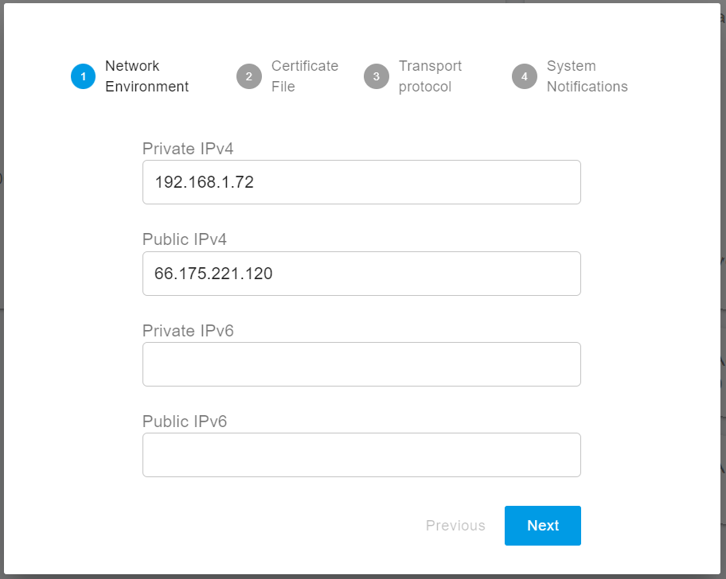

# Installation of the PortSIP PBX Beta Version

The PortSIP PBX v22.0 is the next major release, this guide is just for installing the PortSIP PBX v22.0 b**eta version**.

Before you start, please acknowledge the following points:

* Currently, the v22.0 is still in the beta stage, don't use it for the production environment.
* The beta version is only available for Linux, suggest Debian 11/12, and Ubuntu 22.04/24.04.
* Since this is the beta version, it can't be upgraded from the current v16.x installation seamlessly, you must install it on a new server.
* Since this is the beta version, it also does not support back-compatibility between beta versions, which means, you need to uninstall and delete the previous beta version if you want to install a new beta version.

Of course, once the v22.0 is officially released, it can upgrade from the v16.x installation seamlessly.


The beta version is only for test purposes, please don't use the beta version for a production environment, we do not guarantee any feature and data for the beta version.


## Supported Linux OS

The PortSIP PBX only supports the following 64-bit Linux OS:

* Ubuntu 22.04, 24.04
* Debian 11.x, 12.x

## Minimal Hardware Requirements

The PortSIP PBX requires at least 2 cores, 4G memory, and 30GB HDD.  With this hardware, if without the call recording, it can support 1,000 users online and 300 - 400 simultaneous calls.

## Preparing the Linux Host Machine for Installation

Tasks that MUST be completed before installing PortSIP PBX

* **Ensure the server date-time is synced correctly**.
* Use the `sudo` to perform the installation is recommended.
* If the Linux on which PBX will be installed is located on a LAN, assign a**`static private IP address`**to the PBX server; if it's on a public network, assign a**`static public IP address`** and a **`static private IP`** to the PBX server.&#x20;
* Install all available updates and service packs before installing PortSIP PBX.
* Do not install **PostgreSQL** on your PortSIP PBX Server.
* Ensure that all power-saving options for your system and network adapters are disabled (by setting the system to High-Performance mode).
* Do not install TeamViewer, VPN, or other similar software on the host machine.
* The PortSIP PBX must not be installed on a host that is a DNS or DHCP server.
* The below ports must be permitted by your firewall.
  * UDP: 5060, 5066, 25000-34999, 45000–65000
  * TCP: 5061, 5063, 5065, 5067, 8882, 8883, 8887, 8888, 8889, 10443. please also ensure the above ports have not been used by other applications.


If the PBX runs on a cloud platform such as AWS and the cloud platform has its own firewall, you **must** also open the ports on the cloud platform's firewall.


## Step 1: Download the  Installation Scripts


All commands must be executed in the **`/opt/portsip`** directory.


Execute the below commands to download the installation scripts.

```shell
sudo mkdir -p /opt/portsip
```

```shell
cd /opt/portsip
```

```sh
sudo rm -rf *.sh
```


```bash
sudo curl \ 
https://raw.githubusercontent.com/portsip/portsip-pbx-sh/master/v22.x/install_docker.sh \
-o install_docker.sh
```



```bash
sudo curl \ 
https://raw.githubusercontent.com/portsip/portsip-pbx-sh/master/v22.x/pbx_ctl.sh \
-o pbx_ctl.sh
```



```sh
sudo curl \ 
https://raw.githubusercontent.com/portsip/portsip-pbx-sh/master/v22.x/im.sh \ 
-o im_ctl.sh
```


## Step 2: Setup the Docker Environment

Execute the below command to install the `Docker-Compose` environment. If you get the prompt likes`*** cloud.cfg (Y/I/N/O/D/Z) [default=N] ?`, enter the **Y** and then press the **Enter** button.

```shell
/bin/sh install_docker.sh
```

## Step 3: Create and Run the PortSIP PBX Docker Container Instance

The below command is used to create and run the PBX on a server whose **public IP address** is`66.175.221.120`. If running the PBX in a LAN without the public IP address, just replace the IP `66.175.221.120` with the PBX server's **LAN private IP address**.


If your PBX server has a public IP, you must use it in the below command for the `-a` parameter. If not, the PBX won’t work with the internet trunk.


```shell
/bin/sh pbx_ctl.sh \
run -p /var/lib/portsip \
-a 66.175.221.120 \
-i portsip/22.0.30.1240-beta
```

* \-p: Used to specify the path for storing the PBX data
* \-a: Used to specify the PBX server IP address
* \-i: Used to specify the PBX docker image version

In the above example, this `22.0.30.1240-beta` is the beta version you want to install, you can check the latest beta version at this [docker hub page](https://hub.docker.com/r/portsip/pbx/tags).

After successfully installing the PortSIP PBX beta version, now you can use`https://66.175.221.120:8887` to access the PBX Web portal; the default system administrator name and password are`admin`.

## Step 4: Configure the PortSIP PBX

Once the PortSIP PBX is successfully installed, you can access the web portal by opening your browser and navigating to [**https://66.175.221.120:8887**](https://66.175.221.120:8887). If your browser displays an SSL certificate warning, you may safely ignore it and proceed. You will then be directed to the login page, as shown in the screenshot below.

<figure><figcaption></figcaption></figure>

Click on **"Sign in as the administrator or dealer"** to navigate to the administrator login page, as shown in the screenshot below. Enter **admin** as both the username and password to log in to the web portal.

<figure><figcaption></figcaption></figure>


Please change the default password of the admin after you log in.


After successfully logging in to the PBX Web Portal, the dashboard will appear as shown in the screenshot below.

<figure><figcaption></figcaption></figure>

With the new installation, the PBX will pop up the setup wizard to guide you to complete the mandatory settings.

### 1. Network Environment

* If the PBX server has a static public IP address, enter it in the **Public IPv4** field. If the server does not have a static public IP, leave the **Public IPv4** field blank.
* You must enter the private IPv4 address. If the server does not have a private IP, use the public IP address instead.
* The IP addresses must be accessible by your SIP client, as the IP address entered here will serve as the SIP server IP for the PBX. This address is essential when a SIP client or IP phone registers to PortSIP PBX and should be configured as the **Outbound Proxy Server**.
* If the PBX is deployed in the cloud, both **Private IPv4** and **Public IPv4** must be entered. If the PBX is on a LAN, only the **Private IPv4** should be entered.


The loopback interface (127.0.0.1) is unacceptable for the private IP. Only the static IP for the LAN where the PBX is located is allowed (do not use DHCP dynamic IP).&#x20;


<figure><figcaption></figcaption></figure>

### 2. SSL Certificate

To enable TLS transport for SIP and secure HTTPS access to the Web Portal and REST API, a trusted SSL certificate must be uploaded to the PBX during this step.

* You'll need to have a web domain. For example, you can purchase a domain from a provider like GoDaddy and point it to your PBX IP address.
* Additionally, you must purchase a trusted SSL certificate for this domain to avoid browser warnings. Recommended certificate providers include Digicert, GeoTrust, GoDaddy, or others.
* If you do not have a domain or SSL certificate, you can simply use the PBX IP address as the **Web Domain** and proceed with the default certificate. However, note that PortSIP PBX uses a self-signed certificate by default, which will cause most browsers to block the connection and display a security warning.

Please follow up on this guide for purchasing the SSL certificate: [Preparing TLS Certificates for TLS/HTTPS/WebRTC](certificates-for-tls-https-webrtc/).

You have two certificate files.

* portsip.key
* portsip.pem

To configure the certificates:

1. In the **Web Domain** field, enter **uc.portsip.cc**.
2. Open the **portsip.pem** file in a text editor like Windows Notepad, and copy its entire contents into the **Certificate File** field.
3. Similarly, open the **portsip.key** file, and copy its entire contents into the **Private Key File** field.

<figure><figcaption></figcaption></figure>

### 3. Transport Protocol

You can configure the transport layer protocol for SIP signaling by clicking the **Add** button. The default transport ports are:

* **UDP:** 5060
* **TCP:** 5063
* **TLS:** 5061

You are free to change these default ports to any preferred port, but ensure that the new port is not already in use by other applications.


After adding a new transport protocol, be sure to update your firewall rules to allow traffic on the newly assigned transport port. The IP Phone client app will use this transport and port to connect to the PBX.


<figure><figcaption></figcaption></figure>

### 4. System Notifications

To enable email notifications in PortSIP PBX for system alerts, you must configure the SMTP settings. Once a critical event occurs in the PBX, alert emails will be sent to the specified **Recipients**.

**Google**

If you’re using Google’s SMTP server, ensure that **less secure apps** is enabled for your Gmail account. For more details, refer to Google's documentation:

[Less secure apps & your Google Account ](https://support.google.com/accounts/answer/6010255?hl=en)

Additionally, you’ll need to select either SSL or TLS as the security protocol for the Google SMTP server. Use the following settings:

* SMTP Server: smtp.gmail.com
* Port: 587
* Username: The username of the SMTP server
* Password: Your password
* Sender Email: The sender's email address
* Use TLS: ON

**Microsoft 365**

If you’re using the Microsoft 365 SMTP server, SSL or TLS must also be selected as the security protocol. Use the following settings:

* SMTP Server: smtp.office365.com
* Port: 587
* Username: The username of the SMTP server
* Password: Your password
* Sender Email: The sender's email address
* Use TLS: ON

<figure><figcaption></figcaption></figure>

### 5. Reboot to Apply the Certificate

If you uploaded a trusted certificate in [2. SSL Certificate](installation-of-the-portsip-pbx-beta.md#id-2.-ssl-certificate) File (instead of the default self-signed certificate), you need to restart the PBX to apply the certificate. Use the following commands to reboot the PBX:

```sh
cd /opt/portsip
sudo /bin/sh pbx_ctl.sh restart
```

## Step 5: Install Instant Messaging Service

From v22.0, PortSIP PBX introduced an Instant Messaging service to provide modern IM features such as group chat, the IM service requires installation with a separate step since in some scenarios you may want to install it on an extra server to have the best performance.

Please follow the below steps to install the IM server.

### Generate Token for IM Server

* Sign in as the system administrator into the PortSIP PBX Web portal
* Navigate to the menu Servers > IM Servers, select the default server, click the Generate Token button, and then copy the token.

<figure><figcaption></figcaption></figure>

### Create and Run Instant Messaging Docker Instance

First, go to the `opt/portsip` path.

```sh
cd /opt/portsip
```

Perform the below command to create the IM service docker instance.

* \-p: Used to specify the path for storing the data
* \-a: Used to specify the server IP address
* \-i: Used to specify the PBX docker image version
* \-t: Use this parameter to specify the token that you copied in the previous step


```sh
sudo /bin/sh im_ctl.sh run -p /var/lib/portsip/ portsip/22.0.30.1240-beta \ 
-t MJC4NZBLYTGTZTJJNS0ZMWZHLWIXZDCTZJLLMDEWZJHKZTAY
```


Now the PortSIP PBX is successfully installed.

