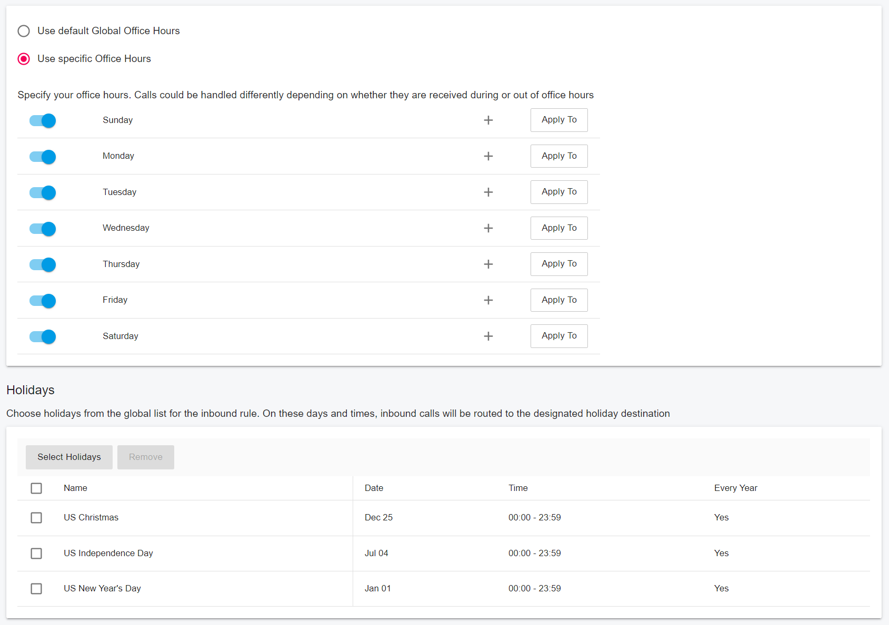
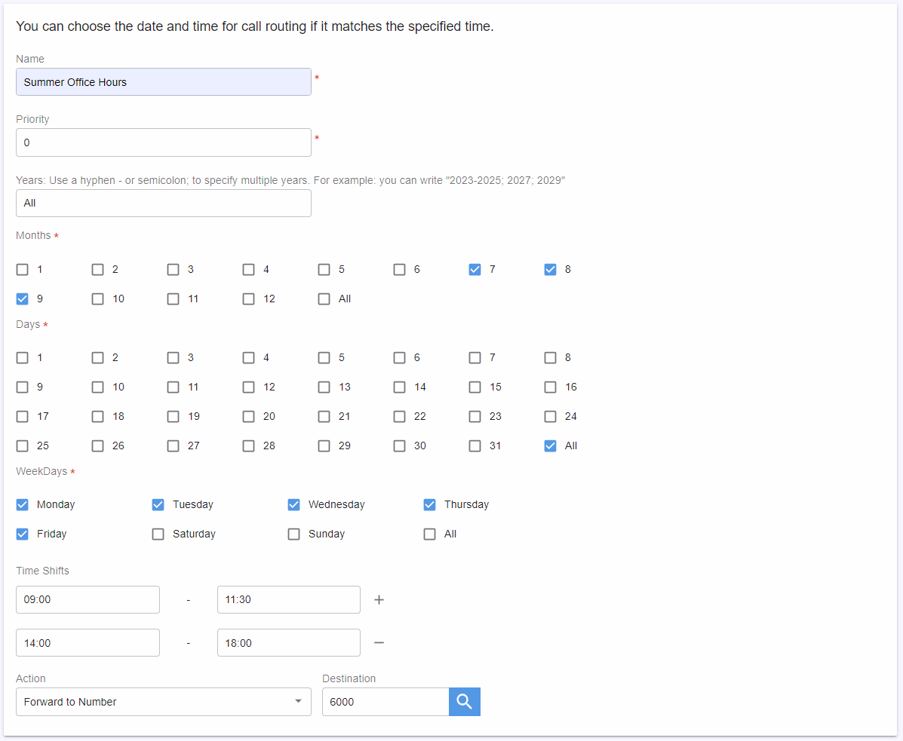
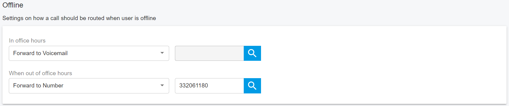

# Routing Calls Based on Office Hours and Holidays

PortSIP PBX allows you to route calls based on office hours, holidays, and other situations where you need to reroute calls to another destination.

## Inbound Call Routing

PortSIP PBX routes all inbound calls from the SIP trunk by creating inbound rules. In an inbound rule, you can specify which SIP trunk the call is coming from, specify the CID and DID numbers, and set the routing destination based on office hours and holidays.

<figure><figcaption></figcaption></figure>

In the inbound rule shown in the screenshot above, if a call arrives during a **holiday**, it will be routed to extension **103**. If it arrives during office hours, it will be routed to extension **101**. If it arrives outside of office hours, it will be routed to extension **102**.

In an inbound rule, clicking the **Office Hours** tab allows you to set up office hours and holidays for that rule. You can choose to use the **Global Office Hours** or define custom office hours for this rule. You can also select holidays from the **Global Holiday List** for the rule.

<figure><figcaption></figcaption></figure>

### Advanced Routing for Inbound Rule

In addition to office hours and holidays, you can also route inbound calls based on the customized date and time to a specified destination.

In an inbound rule, clicking the **Advanced Routing** tab allows you to create advanced routing strategies.

<figure><figcaption></figcaption></figure>

An advanced Routing strategy allows you to route an inbound call based on the years, months, days, weekdays, and time shifts to a number, voicemail, or hang up.

<figure><figcaption></figcaption></figure>

As shown in the above screenshot, you can set the following fields:

* `priority`: The PBX will check routing strategies in order of priority. If the current date and time do not match the strategy, we will try the next strategy with a lower priority. The priority range is 0-1000, with 0 being the highest priority.
* `years`: Specifies the years for this routing strategy. This strategy will be ignored if the current time does not match the specified years. You can specify a range of years (e.g., 2023-2030), a single year (e.g., 2031), or a combination (e.g., 2023-2030;2035;2032). Enter the`all` to specify all years. If you leave this value empty, it is the same thing as entered `all`.
* `months`: Specifies the months for this routing strategy. This strategy will be ignored if the current time does not match the specified months. You can specify a range of months (e.g., 1-9), a single month (e.g., 11), or a combination (e.g., 1-9;11;12). Select the `all` to specify all months.
* `days`: Specifies the days of the month for this routing strategy. This strategy will be ignored if the current time does not match the specified days. You can specify a range of days (e.g., 1-21), a single day (e.g., 11), or a combination (e.g., 1-9;11;22). Select the `all` to specify all days of the month.
* `weekdays`: Specifies the weekdays for this routing strategy. This strategy will be ignored if the current time does not match the specified weekdays. You can specify a range of weekdays (e.g., 1-5), a single day (e.g., 3), or a combination (e.g., 1-3;4). Select the `all` to specify all weekdays. Note that 1 is Monday and 7 is Sunday.
* `time shifts`: Specifies time shifts for this routing strategy. For example: `9:00-11:30;14:00-18:00`. This strategy will be ignored if the current time does not match the specified time shifts.&#x20;
* `destination`: Specifies the route destination and action:
  * `action`: Allows you to set the action to `number`, `voicemail`, or `hangup`. The `number` action routes the call to a specified number. While `voicemail` routing it to an extension’s voicemail. The `hangup` action hangs up the inbound call.&#x20;
  * `dest`: The destination number for the action. If the action is set as `hangup`, this value will be ignored.

For example, if the `action` is set to `number` and `dest` is set to `123456`, the call will be routed to the number `123456` if this routing strategy is matched.


If you would like to route the call to a shared voicemail, just choose the **action** as the **number**, and set the **dest** to the shared voicemail number.


You can create as many advanced routing strategies as you need. The PBX will try to match them by the strategy's priority. The lower priority value has a higher priority.

### Fallback for Advanced Routing

If a call fails to match any strategy in the advanced routing, the call routing will fall back to the office hours and holiday routing specified in the inbound rule.

## Outbound Call Routing

PortSIP PBX allows tenant admin to specify office hours and holidays for outbound rules. If the current time falls outside of the specified office hours or on a holiday, the outbound rule will be blocked by the PBX.&#x20;

To set up office hours and holidays for an outbound rule, click on the **Office Hours** tab of the inbound rule. From here, you can choose to use the **Global Office Hours** or define custom office hours for this rule. You can also select holidays from the **Global Holiday List** to apply to this rule. If you do not want to block the outbound rule at any time, do not select any holidays and specify that all days and times are within office hours.

## Extension Call Routing

Each extension can have a set of call forwarding rules that define what PortSIP PBX should do when the extension user is unable to answer an incoming call. This can be configured using the following criteria.

* The user’s status
* The time

When an extension is offline, the PBX will check the extension’s office hours and holiday settings. If the current time falls outside of office hours or on a holiday, the call will be rerouted to the destination specified in the "**When out of office hours**" field. This destination can be an extension number, phone number, or mobile phone number. For example, in the screenshot below, calls are rerouted to **332061180**.&#x20;

If the current time falls within office hours and is not on a holiday, the call will be rerouted to the destination specified in the "**In Office Hours**" field. In the screenshot below, calls are rerouted to that extension’s voicemail.

<figure><figcaption></figcaption></figure>


An extension can select holidays from the tenant-level holiday list and also create its own custom holidays. Both types of holidays will be treated as falling outside of office hours.


### Exceptions for Extension

You can create exception rules for an extension by entering the caller ID, selecting the time shifts in the "**Received During"** field, and choosing the desired action in the "**Forward To"** field.

If a call matches one of the exceptions, it will be rerouted according to that exception rule and the extension’s normal forwarding rules will be bypassed.

