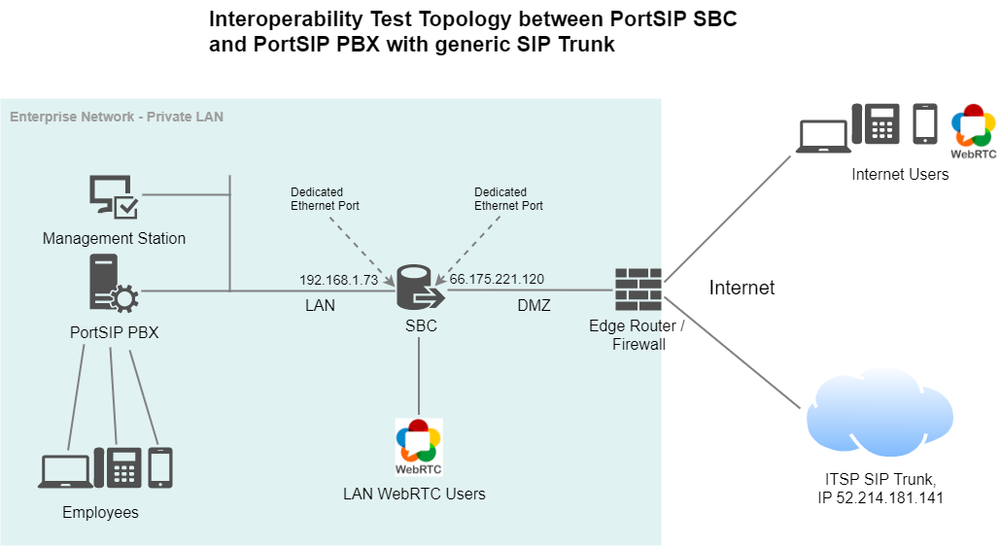

# PBX and SIP Trunk using PortSIP SBC

This topic describes how to set up PortSIP SBC for interworking between the generic SIP trunk and PortSIP PBX.

## 1 Topology of the Interoperability Environment

The interoperability testing between SBC and a generic SIP Trunk with PortSIP PBX was done using the following topology setup:&#x20;

* Enterprise deployed with PortSIP PBX in its private network for enhanced communication within the Enterprise.&#x20;
* Enterprise wishes to offer its employees enterprise-voice capabilities and to connect the Enterprise to the PSTN network using a SIP Trunking service.&#x20;
* PortSIP SBC is implemented to interconnect between the Enterprise LAN and the SIP Trunk.&#x20;
  * Session: Real-time voice session using the IP-based Session Initiation Protocol (SIP).
  * Border: IP-to-IP network border between PortSIP PBX network in the Enterprise LAN and SIP Trunk located in the public network. The figure below illustrates this interoperability topology:

<figure><figcaption></figcaption></figure>

## 2 Configuring PortSIP PBX

Please follow the below topics to install and configure the PBX:

* [1 Installation of the PortSIP PBX](broken-reference)
* [2 Configuring the PortSIP PBX](2-configuring-the-portsip-pbx.md)

## 3 Configuring PortSIP SBC

Please follow the below topics to install and configure the SBC:

* [Configuring SBC for WebRTC](9-configuring-portsip-sbc/)

## 4 Adding SIP trunk to the PortSIP PBX

Assuming the trunk information is below:

* SIP Trunk in the internet
* SIP Trunk IP is 52.214.181.141, port 5060
* SIP Trunk transport is UDP
* SIP Trunk is **IP authorization** mode or **register authorization** mode

To add the trunk to the PBX:

1. Sign in to the PortSIP PBX Web Portal by "**System Admin**" credentials, and click the menu "**Call Manager > Trunks**".
2. Click the arrow button to choose the **IP-based** or **Register-based** trunk type to add.
3. Enter a friendly name for this trunk, and fill in the "**Host Domain or IP**" with SIP trunk IP `52.214.181.14` and "**Port**" with 5060. If the trunk port is not 5060, please enter the actually port.
4. Fill the "**Outbound Proxy Server**" with the SBC private IP in case is `192.168.1.73`, and fill the "**Outbound Proxy Server port**" with the SBC port `5069` , by default, the SBC uses the port `5069` on TCP to receive the SIP message from PBX.
5. Select the `TCP` transport and click the "**Next**" button.
6. If the trunk is "**Register based**" type, enter the "**Authorization Name**" and "**Password**" here, it gave by your trunk service provider.&#x20;
7. Turn on the "**Trunk is located in same LAN with PBX**" option.
8. Turn off the "**Rewrite the host IP of Via header by public IP when sending the request to trunk**" option and click the "**Next**" button.
9. Since the trunk is added by the "**System Admin**", the "**System Admin**" will need to choose one or more tenants to allow them access to this trunk. Please refer to the "**Add the Trunk by System Admin"** section of [Trunk Management](7-trunk-management/)**.**

In summary, just add the SBC likes add a normal trunk, fill the trunk's IP or domain to the "**Host Domain or IP**", and fill the SBC's IP and port to the "**Outbound Proxy Server**", set the transport to TCP since the PBX use TCP to communicate with the SBC, and the call flow is:

**extension <---> PBX <---> SBC <---> SIP Trunk**

Now you completed the SBC trunk settings, you can follow this guide to create the i[nbound and outbound rules](8-call-route-management/) as the normal trunk.

