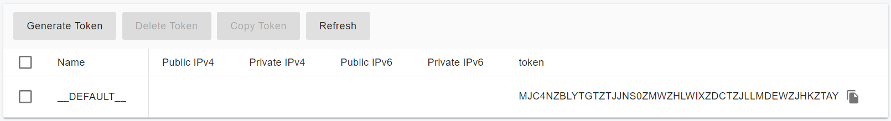
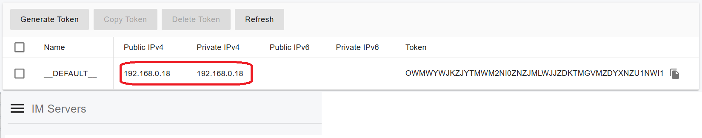

# Installation of the PortSIP IM Server

The installation of the IM Server is a separate step, required only when PortSIP PBX is installed on a Linux server.

Before proceeding with this guide, ensure that you have already completed the [Installation of the PortSIP PBX v22.x](../1-installation-of-the-portsip-pbx/installation-of-portsip-pbx-v22.md).

You have two options for deploying the PortSIP IM Server:

1. **Same server as PortSIP PBX**: If you have a smaller number of users, you can install the IM Service on the same server as your PortSIP PBX. This setup is simpler but may not provide optimal performance for larger user bases.
2. **Separate server**: For better performance, especially when dealing with a large number of users who require chat and file-sharing capabilities, it is recommended to install the IM Server on a separate, more powerful server.

## **Supported Linux OS** <a href="#supported-linux-os" id="supported-linux-os"></a>

It only supports 64-bit OS.

* Ubuntu 22.04, 24.04
* Debian 11.x, 12.x

## Install IM Service on the Same Server as PortSIP PBX

Follow these steps to install the IM server on the same server as PortSIP PBX.

### Step 1: Generate Token for the IM Server

1. Log in as the **System Administrator** to the PortSIP PBX Web portal.
2. Navigate to **Servers > IM Servers**.
3. Select the default server and click the **Generate Token** button.
4. Copy the generated token.

<figure><figcaption></figcaption></figure>

### Step 2: Create and Run Instant Messaging Docker Instance

Follow these steps to create the IM service Docker instance:

1. Navigate to the **/opt/portsip** directory by running the following command:

```sh
cd /opt/portsip
```

2. Use the command below to create the Instant Messaging service Docker instance. Replace the placeholders with your actual values:

* **-p**: Specifies the path for storing the IM service data.
* **-a**: Specifies the IP address of the server.
* **-i**: Specifies the PBX Docker image version.
* **-t**: Specifies the token generated in the previous step.


```sh
sudo /bin/sh im_ctl.sh run -p /var/lib/portsip/ -i portsip/pbx:22.0.33.1354-beta \
-t MJC4NZBLYTGTZTJJNS0ZMWZHLWIXZDCTZJLLMDEWZJHKZTAY
```


If everything is set up correctly, the PBX web portal will display the IM server's IP address, as shown in the screenshot below.

<figure><figcaption></figcaption></figure>

The Instant Messaging (IM) server has been successfully installed. We can now proceed with the next steps in the PortSIP PBX installation process.

## Install IM Service on a Separate Server

For optimal performance, it’s recommended to install the IM service on a separate server, especially when handling a large number of users for chat and file-sharing activities (including files and pictures). The following hardware specifications are suitable for supporting up to 50,000 users online, with messaging and file sharing:

* **CPU**: 20 cores or higher
* **Memory**: 16 GB
* **Disk**: High I/O performance required (SSD recommended, at least 256 GB)
* **Network Bandwidth**: 1000 Mbps or higher, particularly if handling high volumes of messages and file sharing.

### Step 1: **Preparing the Linux server for Installation**

Tasks that MUST be completed before installing cluster servers.

* **Ensure the server date-time is synced correctly**.
* If the Linux server is on a LAN, assign a **Static Private IP** address.
* For the **media server cluster**, each media server also needs a **Static Public IP** address if you want the user to call from the Internet.
* Install all available updates and service packs before installing the cluster server.
* Do not install PostgreSQL on the Server.
* Ensure that all power-saving options for your system and network adapters are disabled (by setting the system to High-Performance mode).
* Do not install TeamViewer, VPN, or similar software on the host machine.
* The server must not be installed as a DNS or DHCP server.

### Generate Token for the IM Server

1. Log in as the **System Administrator** to the PortSIP PBX Web portal.
2. Navigate to **Servers > IM Servers**.
3. Select the default server and click the **Generate Token** button.
4. Copy the generated token.

<figure><figcaption></figcaption></figure>

### Step 2: Create and Run Instant Messaging Docker Instance

Follow these steps to create the IM service Docker instance:

1. Navigate to the **/opt/portsip** directory by running the following command:

```sh
cd /opt/portsip
```

2. Use the command below to create the Instant Messaging service Docker instance. Replace the placeholders with your actual values:

* **-p**: Specifies the path for storing the IM service data.
* **-a**: Specifies the IP address of the server.
* **-i**: Specifies the PBX Docker image version.
* **-t**: Specifies the token generated in the previous step.


```sh
sudo /bin/sh im_ctl.sh run -p /var/lib/portsip/ -i portsip/pbx:22.0.33.1354-beta \
-t MJC4NZBLYTGTZTJJNS0ZMWZHLWIXZDCTZJLLMDEWZJHKZTAY
```


If everything is set up correctly, the PBX web portal will display the IM server's IP address, as shown in the screenshot below.

<figure><figcaption></figcaption></figure>

## Install IM Service on the Same Server as PortSIP PBX

Tasks that MUST be completed before installing cluster servers.

* **Ensure the server date-time is synced correctly**.
* If the Linux server is on a LAN, assign a **Static Private IP** address.
* For the **media server cluster**, each media server also needs a **Static Public IP** address if you want the user to call from the Internet.
* Install all available updates and service packs before installing the cluster server.
* Do not install PostgreSQL on the Server.
* Ensure that all power-saving options for your system and network adapters are disabled (by setting the system to High-Performance mode).
* Do not install TeamViewer, VPN, or similar software on the host machine.
* The server must not be installed as a DNS or DHCP server.

### **Setup the Docker Environment** <a href="#setup-the-docker-environment" id="setup-the-docker-environment"></a>

**On each server**, execute the below commands to download the installation scripts:

```sh
sudo curl \
https://raw.githubusercontent.com/portsip/portsip-pbx-sh/master/v22.x/init.sh  \
-o  init.sh
```

```sh
sudo /bin/sh init.sh
```

Execute the below command to install the `Docker-Compose` environment. If you get the prompt likes`*** cloud.cfg (Y/I/N/O/D/Z) [default=N] ?`, enter the **Y,** and then press the **Enter** button.

```sh
cd /opt/portsip
```

```sh
sudo /bin/sh install_docker.sh
```


