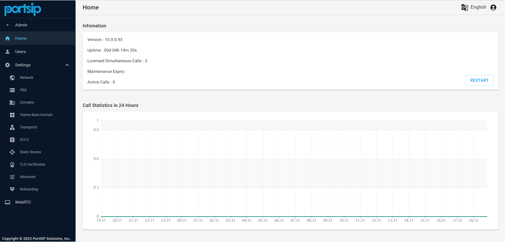
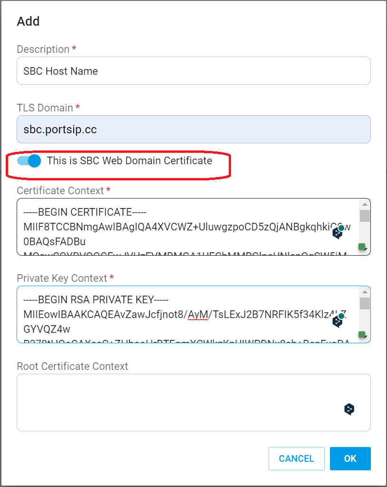
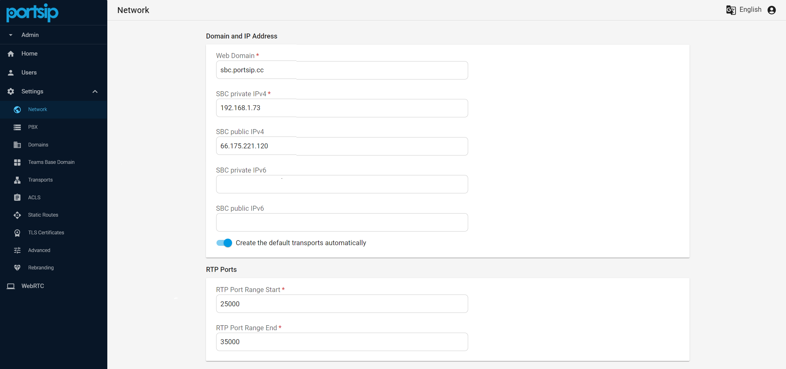
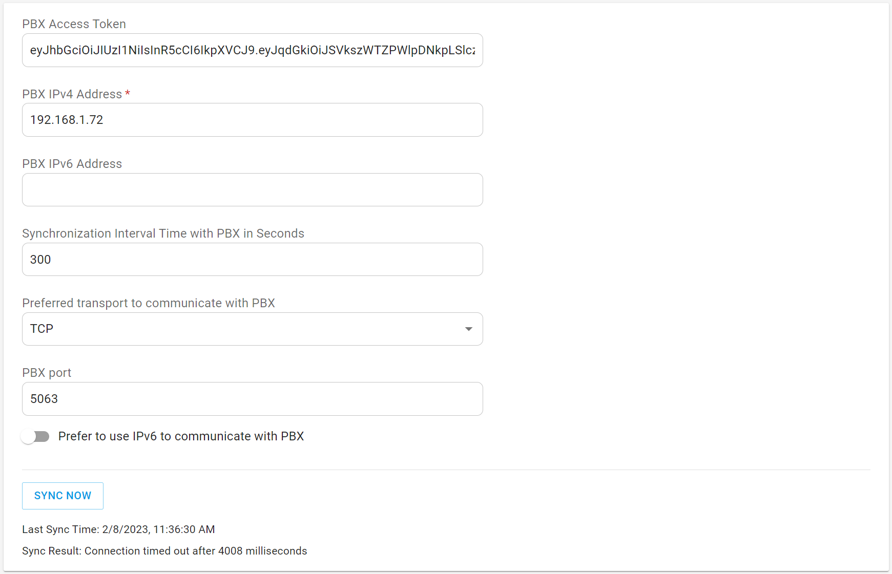
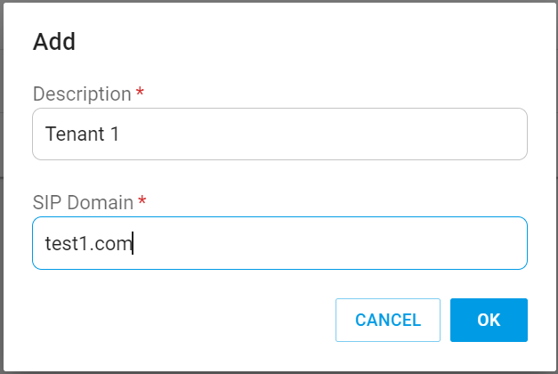
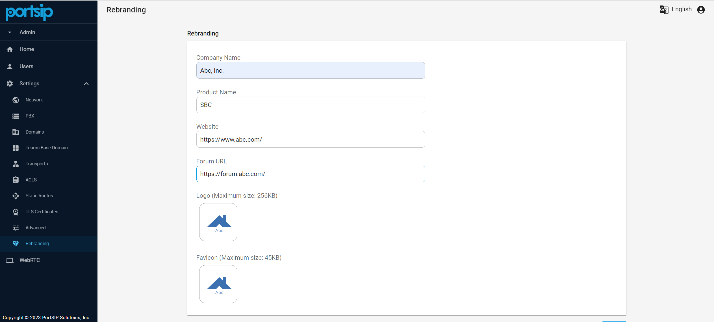

# 2 Configure the PortSIP SBC

In this guide, we will assume that the SBC is installed on a server with a static private IP of `192.168.1.73` and a static public IP of `66.175.221.120`, and that the domain `sbc.portsip.cc` has been resolved to the IP `66.175.221.120` .

The PBX is located on the same LAN as the SBC server, and the private IP is `192.168.1.72`. The PBX is required to support the `Path Header` which is defined in [RFC3327](https://datatracker.ietf.org/doc/html/rfc3327).&#x20;

After the [PortSIP SBC](https://www.portsip.com/portsip-sbc/) has been installed successfully, use your browser to access the web portal at [https://sbc.portsip.cc:8883](https://sbc.portsip.cc:8883). The sign-in page looks like the one in the screenshot below. Enter "**admin**" for both the username and password to log in.&#x20;

<figure><figcaption></figcaption></figure>

## 2.1 TLS certificates

Please follow this topic to [prepare the TLS Certificates](../portsip-pbx-administration-guide/certificates-for-tls-https-webrtc/).

Choose "**Settings > TLS Certifidates**" from the menu, click **Add** button, and type "**SBC Host Name**" for the "**Description**" field as an example; fill the `sbc.portsip.cc` in the "**TLS Domain**" field. Open the "**portsip.pem**" file in Windows Notepad and copy the contents into the "**Certificate Context**" field. Copy and paste the contents of the "**portsip.key**" file into the "**Private Key Context**" field. Click the **OK** button to save the certificates.

<figure><figcaption></figcaption></figure>

## 2.2 Setup Network

Select "**Settings > Network"** from the menu, and fill in the "**Web Domain"** field with `sbc.portsip.cc`, the "**Private IPv4**" field with`192.168.1.73`, and the "**Public IPv4**" field with `66.175.221.120`. By default, the "**Create default transports automatically**" option is turned on, and the SBC will create the default transports after successfully setting up the SBC IP address.&#x20;

* `TCP on port 5069` : it's used to communicate with PBX; &#x20;
* `TLS on port 5067` : it's used to communicate with Microsoft Teams;&#x20;
* `WSS on the port 5065` : it's used to provide the WebRTC service.&#x20;
* `UDP on the port 5066`: it's used to provide the normal SIP service.&#x20;

You can turn off this option to prevent the SBC from automatically creating default transports, but this is not recommended.

The **private IPv4 address** must be entered; if your server does not have a private IP, please enter the public IP instead.&#x20;

By default, the SBC uses UDP ports `25000–35000` for the RTP transmission. You can feel free to change the port range but ensure other applications do not use the ports, we suggest keeping the default settings.&#x20;

When you click the **OK** button, SBC will restart automatically and immediately sign you out.

<figure><figcaption></figcaption></figure>


If you change the default RTP ports, please ensure they are not used by other applications and add firewall rules for them.


## 2.3 Configuring PBX Settings

### Configuring for PortSIP PBX

If the PBX is [PortSIP PBX](https://www.portsip.com/portsip-pbx/), please follow the below steps.

1. Sign in to the PBX web portal, [https://uc.portsip.cc:8887](https://uc.portsip.cc:8887), and click the menu "**Advanced > SBC**". Click the "**Generate"** button to generate the token for the SBC's access. Click the **Copy** button to copy the token.
2. Sign in to the PortSIP SBC Web Portal [https://sbc.portsip.cc.cc:8883](https://sbc.portsip.cc.cc:8883). Choose **Settings > PBX** from the menu. You have to set up the PBX information here then the SBC will communicate with the PortSIP PBX. Paste the copied token to the "**PBX Access Token**" field, and enter the PBX private IP `192.168.1.72` for the "**PBX IPv4 Address**" field. Since the TCP transport is created on the port `5063` in the PortSIP PBX, please choose the **TCP** for "**Prefer to transport to communicate with PBX**", and enter "**5063**" for "**PBX Port**".

<figure><figcaption></figcaption></figure>

### Configuring for 3rd PBX

If the PBX is **NOT** PortSIP PBX, please follow the below steps.

1. Create a **TCP transport on 5063** in your PBX
2. Sign in to the PortSIP SBC Web Portal [https://sbc.portsip.cc:8883](https://sbc.portsip.cc.cc:8883). Choose **Settings > PBX** from the menu. You have to set up the PBX information here then the SBC will communicate with the PortSIP PBX.  Enter the PBX private IP `192.168.1.72` for the "**PBX IPv4 Address**" field. If If the TCP transport is created on the port `5063` in the 3rd PBX, please choose the **TCP** for "**Prefer to transport to communicate with PBX**", and enter "**5063**" for "**PBX Port**". If your PBX TCP transport is not `5063` but it's `5061` for example, then you will need to enter the `5061`  for the "**PBX Port**" in SBC Web Portal.


If your PBX TCP transport is not 5063 but it's 5061, then you will need to enter the 5061  for the "**PBX Port**" in SBC Web Portal.


## 2.4 Transports

Choose "**Settings > Transports**" from the menu. The SBC requires adding four types of transport here.&#x20;

* A TCP transport for the SBC to communicate with the PBX
* A  TLS transport for the SBC to communicate with the Microsoft Teams
* A WSS transport for the SBC to provide WebRTC service
* A UDP transport for the SBC to provide normal SIP service

One is for the SBC to communicate with the PBX, one is for Microsoft Teams, and one is for the WebRTC clients. After the above step **2.2**  is completed with the "**Create default transports automatically**" option on, the SBC will create the default transport automatically.&#x20;


These default transports aren't recommended to be changed, we recommend keeping the "**Create default transports automatically**" option turned on in the above step 2.2.


<figure><figcaption></figcaption></figure>

<figure><figcaption></figcaption></figure>

### Create Transports

**This step is unnecessary if you keep using the default transport**. If you wish to create your own transport, you can delete the existing transport.

* Add a "**WSS**" transport for WebRTC clients as in the below screenshot, please choose the "**SBC public IP**" for the "**Network Interface**".
* Add a "**TLS**" transport for the SBC to communicate with Microsoft Teams as in the below screenshot, please choose the "**SBC public IP**" for the "**Network Interface**".
* Add a "**UDP**" transport for the SBC to provide the normal SIP service as in the below screenshot, please choose the "**SBC public IP**" for the "**Network Interface**".
* Add the "**TCP**" transport for SBC to communicate with the PBX, please refer to the below screenshot, and choose the "**SBC private IP**" for the "**Network Interface**";&#x20;

<figure><figcaption></figcaption></figure>

### Add Firewall Rules

If you created your own transports rather than using the default transport, please open the ports of your transport on the firewall with the below commands. For example, if you create a **UDP** transport on port **5066**, **TCP** transport on port **5071**, **TLS** transport on port **5072**, and **WSS** transport on port **5075**, please execute the below commands.

#### Linux Firewall

```
firewall-cmd --permanent --service=portsip-sbc --add-port=5066/udp --set-description="PortSIP SBC"
firewall-cmd --permanent --service=portsip-sbc --add-port=5071/tcp --set-description="PortSIP SBC"
firewall-cmd --permanent --service=portsip-sbc --add-port=5072/tcp --set-description="PortSIP SBC"
firewall-cmd --permanent --service=portsip-sbc --add-port=5075/tcp --set-description="PortSIP SBC"
firewall-cmd --reload
```

#### Check opened firewall ports <a href="#check-opened-firewall-ports" id="check-opened-firewall-ports"></a>

The below commands are used to check currently opened ports for PortSIP SBC.

```
firewall-cmd --info-service=portsip-sbc
```

#### Windows Firewall

Create the Windows Firewall Rules as the Windows Guide.


Once a new transport has been added, you have to change the firewall rule to allow the transport port. The IP Phone client app will connect to the PBX via transport and port.



If the SBC runs on a cloud platform such as AWS and the cloud platform has a firewall itself, you must open the ports on the cloud platform firewall as well.



## 2.5 Add SIP Domain

### Sync the SIP domain with PortSIP PBX

If the PBX is [PortSIP PBX](https://www.portsip.com/portsip-pbx/), please follow the below steps.

Select the menu "**Settings > PBX**", and click the **SYNC NOW** button, the PBX will synchronous the PBX SIP domains automatically. You can refresh the page to see the sync result, the "**200 OK** " means successfully synced.

<figure><figcaption></figcaption></figure>

### Add SIP domain for 3rd PBX

If the PBX is **NOT** a PortSIP PBX, please follow the below steps.

1. Select the menu "**Settings > Domains**", click the **Add** button, and enter a friendly name for the "**Description**" field.
2. Copy your PBX SIP domain and paste it to the "**SIP Domain**" field and click the **OK** button to save the SIP domain.
3. Please add the SIP domains of all tenants to the SBC as described above if your PBX is a multi-tenant PBX.

<figure><figcaption></figcaption></figure>

## 2.6 Rebranding

The [PortSIP SBC](https://www.portsip.com/portsip-sbc/) allows you to rebrand the SBC in an easy way, you can get your own SBC with just a few clicks.

Select the menu "**Settings > Rebranding**", you can change the company name, product name, and likes, and upload your logo and favicon, click the "**OK**" button to save the settings.

<figure><figcaption></figcaption></figure>
