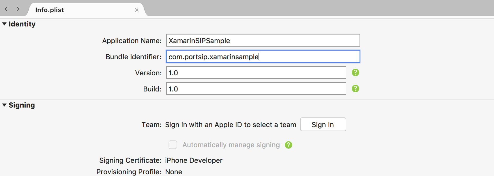
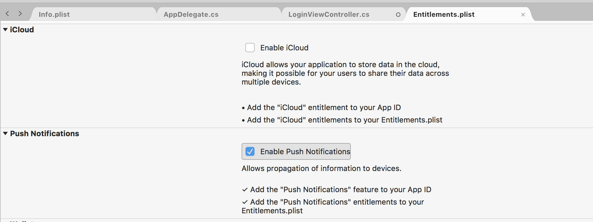
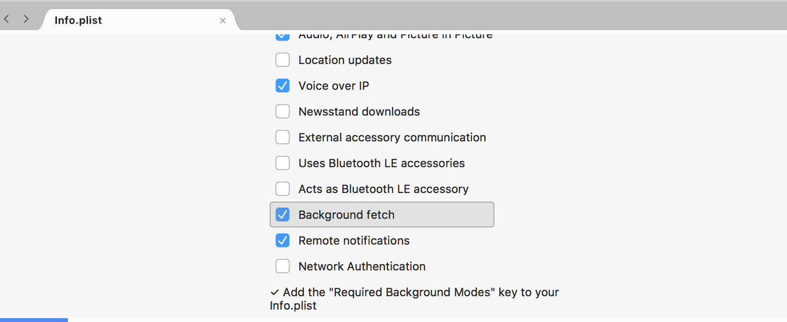

# Implement the PUSH notifications in Xamarin iOS APP with PortSIP PBX 12.x


This guide gives you step-by-step instructions on how to create a native iOS app based on [PortSIP VoIP SDK](https://www.portsip.com/portsip-voip-sdk), which could receive VoIP push notifications sent from [PortSIP PBX](https://www.portsip.com/portsip-pbx).

### **1. VoIP notifications**

The official documentation can be found [here](https://developer.apple.com/library/content/documentation/Performance/Conceptual/EnergyGuide-iOS/OptimizeVoIP.html). Some of the advantages include:

* The App is automatically relaunched if it’s not running when a VoIP push is received
* The device is woken up only when VoIP push occurs (to save battery)
* VoIP pushes go straight to your app for processing and are delivered without delay
* The App is automatically relaunched if it’s not running when a VoIP push is received

### **2. Prerequisite settings**

Apple provides us with a framework called PushKit to support using this VoIP push feature. However, we need to configure some additional settings to get this working.

### **3. Creating an App ID**

In case you don’t have an app (and consequently an App ID), you need to create one.\
First, login to your [Apple developer account](https://developer.apple.com/account/) and access **Certificates, Identifier & Profiles**:


Next, go to **Identifiers -> App IDs** and click on the + button.


Two important things to fill out here are: **App ID Description** and **so-called Bundle ID** (this will most likely be something like com.yourdomain.yourappname):


Although not seen in the screenshots above, I used **PortSIPVoipTest** as Bundle ID. This will be important in the next step.

### **4. Generating a VoIP push certificate**

To generate a VoIP push certificate, first of all you need to login:\
[https://developer.apple.com/account/ios/certificate](https://developer.apple.com/account/ios/certificate)

Click on the **All** button in the **Certificates** section on the left-hand side and the **+** button:


On the next page you need to select the VoIP Services Certificate:


After this you need to select the App ID for which you’re creating this VoIP certificate:


Next, you’ll be presented with instructions on how to create a so-called CSR (Certificate Signing Request) file:


Once you create that file, you’ll select it for uploading on the next screen. If everything goes well, you’ll be given the certificate that you **have to** download:


After you download the certificate, open it up, and the Keychain Access application shall open. Now you shall see the certificate under the **My Certificates** section:


### **5. Add VoIP PUSH support into PortSIP SIPSample project**

Download [sample project](https://www.portsip.com/downloads/sdk/iOSSample.zip), unzip it, and open PUSH SIPSample project.

Take special care when setting the Product Name as the Bundle Identifier is set automatically from it. We need to set this to be the same as the Bundle Identifier that we've set in the steps above.



### **6. Setting the appropriate capabilities**

To use the VoIP push in the app, we need to turn ON the Background Modes for our app and check a few of the checkboxes:

 


### **7. Make sure you have selected the following options**

* Enable Push Notifications
* Audio, Airplay, and Picture in Picture
* Voice over IP
* Background fetch
* Remote notifications

### **8. Add the code**

Open AppDelegate.cs and add the import PushKit statement at the top of it.

Next, in the **didFinishLaunchingWithOptions** part of the application function make sure you register for notifications like this:

```
// Some public override bool FinishedLaunching (UIApplication app, NSDictionary options)
{
    Console.WriteLine("FinishedLaunching");
    UIUserNotificationType notificationTypes = UIUserNotificationType.Alert |
        UIUserNotificationType.Badge |
        UIUserNotificationType.Sound;
    var userNoticationSettings = UIUserNotificationSettings.GetSettingsForTypes(notificationTypes, new NSSet(new string[]
    {}));
    app.RegisterUserNotificationSettings(userNoticationSettings);
    return true;
}

```


We need to implement its delegate callback **didRegisterUserNotificationSettings**:

```
public override void DidRegisterUserNotificationSettings(UIApplication application, UIUserNotificationSettings notificationSettings)
{
    PKPushRegistry pushRegistry = new PKPushRegistry(null);
    pushRegistry.Delegate = this;
    pushRegistry.DesiredPushTypes = new NSSet(new string[]
    {
        PushKit.PKPushType.Voip
    });
}

```


In this callback, we register the VoIP notifications since we know that the user has agreed to receive notifications (since this function has been called). We enabled VoIP notifications by declaring the voipRegistry object.

At this point, you will get an error on the pushRegistry.delegate = self; line saying Cannot assign a value of type 'AppDelegate' to type 'PKPushRegistryDelegate!'.

The delegate for pushRegistry is of type PKPushRegistryDelegate which has three methods, two of which are required. (didUpdatePushCredentials and didReceiveIncomingPushWithPayload). We have to define a so-called extension of the AppDelegate class. We do that by adding the following code after all the current code in the AppDelegate.m file:

```
[Register("AppDelegate")] public partial class AppDelegate: UIApplicationDelegate, IPKPushRegistryDelegate
    {
        public void DidUpdatePushCredentials(PKPushRegistry registry, PKPushCredentials credentials, string type)
        {
            if (credentials != null && credentials.Token != null)
            {
                var fullToken = credentials.Token.ToString();
                token = fullToken.Trim('<')
                    .Trim('>')
                    .Replace(" ", string.Empty);
                Console.WriteLine("Token is " + token);
                addPushSupportWithPortPBX(true);
            }
        }
        public void DidReceiveIncomingPush(PKPushRegistry registry, PKPushPayload payload, string type)
        {
            Console.WriteLine("My push is coming!");
            NSString alertKey = new NSString("alert");
            UILocalNotification notification = new UILocalNotification();
            notification.FireDate = NSDate.Now;
            notification.AlertBody = "Receive a new call";
            notification.TimeZone = NSTimeZone.DefaultTimeZone;
            notification.SoundName = UILocalNotification.DefaultSoundName;
            notification.ApplicationIconBadgeNumber = 1;
            UIApplication.SharedApplication.ScheduleLocalNotification(notification);
        }
        
```

After adding this extension you will note that the previously mentioned error disappears.

In the first function, we merely output the device token. We will need this token in the next section when we'll be testing our app with sending VoIP push notifications.

In the second one we 'act' on the received VoIP push notification. In this concrete case, we show a local notification if the app is in the background or an alert if we're in the app. The third function (didInvalidatePushTokenForType) is used for handling when the token is invalidated.

We need to notify PortPBX that this client has enabled PUSH by adding sip header "x-p-push” to REGISTER message.

```
public void addPushSupportWithPortPBX(Boolean enablePush)
{
    if (token == null || token.Length < 1)
    {
        return;
    }
    mPortSIPSDK.clearAddedSipMessageHeaders();
    string bundleIdentifier = NSBundle.MainBundle.BundleIdentifier;
    string pushHeaderInSIPRegisterMessage;
    if (enablePush)
    {
        pushHeaderInSIPRegisterMessage = "device-os=ios;device-uid=" + token + ";allow-call-push=true;allow-message-push=true;app-id=" + bundleIdentifier;
    }
    else
    {
        pushHeaderInSIPRegisterMessage = "device-os=ios;device-uid=" + token + ";allow-call-push=false;allow-message-push=false;app-id=" + bundleIdentifier;
    }
    mPortSIPSDK.addSipMessageHeader(-1, "REGISTER", 1, "x-p-push", pushHeaderInSIPRegisterMessage);
}
addPushSupportWithPortPBX(true);

```

If you want to disable PUSH, you need to use unregister message to indicate PortPBX.

```
addPushSupportWithPortPBX(false);
```

When the App receives PUSH or APP is running, it should register to the server automatically:

```
public void doAutoRegister()
{
    if (textUsername.Text.Length > 1 &&
        textPassword.Text.Length > 1 &&
        textSIPserver.Text.Length > 1 &&
        textSIPPort.Text.Length > 1)
    {
        onOnlineButtonClick(null);
    }
}

```

### **9. Prepare the certificate files**

The VoIP certificate file that we’ve downloaded and added to the KeyChain has to be converted to a different file format so that we’ll be able to use it with the tools and services that I’ve listed above.\
First, you need to open the KeyChain app on your Mac and export (right click and select **Export**) the certificate:


You will get a **YOUR\_CERT.p12** (e.g portgo\_voip\_push.p12) file. Now export the certificate key file.


You will get a YOUR\_CERT\_key.p12(e.g portgo\_voip\_push\_key.p12) file.

Now, navigate to the folder where you have exported this file to and execute the following command:

```
openssl pkcs12 -clcerts -nokeys -out portgo_voip_push.pem -in portgo_voip_push.p12
openssl pkcs12 -nocerts -out portgo_voip_push_key.pem -in portgo_voip_push_key.p12
openssl rsa -in portgo_voip_push_key.pem -out portgo_voip_push_key_nopws.pem
```

This will generate `portgo_voip_push.pem` and `portgo_voip_push_key_nopws.pem` files that we’ll use in the PBX Server.

### **10. Houston**

The Houston will allow us to send the PUSH notifications for the test from the terminal window.

The VoIP certificate file that we’ve downloaded and added to the KeyChain has to be converted to a different file format so that we’ll be able to use it with the tools and services I’ve listed above.

Even though the docs say you can install it simply with _gem install houston_, you will most likely end up (after some StackOverflow searching) using this command to install it:

```
sudo gem install -n /usr/local/bin houston
```

This way you’ll install it to your local bin directory to which you have full rights.\
Houston installed one more tool that will help us send the notifications like this:\
With Terminal navigate to the folder where you have your certificate:

```
cat portgo_voip_push.pem portgo_voip_push_key-nopwd.pem > portgo2in1.pem
```

Copy the device Token from VoIP Push APP and execute a command as follows:

```
apn push "<40cc4209 d0f3ac25 95a7e937 3282897b 211231ef ba66764c 6fd2befa b42076cb>" \
         -c portgo2in1.pem \
         -m "Testing VoIP notifications!"
```

Note, to change the `portgo_voip_push.pem` `portgo_voip_push_key-nopwd.pem` to whatever you named the file in the steps above, you should get the following output in your terminal:

> _1 push notification sent successfully_

And, you should see a push message on your phone in case it was in the foreground.

### **11. PortSIP PBX**

Now sign in PortSIP PBX Management Console, select menu “**Settings**” > “**Mobile PUSH**”.

Click the “**Add New App**” button, you will see below screen:


.png>)

#### **Please set the following items:**

1. **Enabled** – check it to enable PUSH and un-check to disable PUSH.
2. Apple and Google both are provided with the production PUSH server and development PUSH server for sending PUSH notifications. The development production server is usually used during the development stage. Once your app is released, you can change this setting to the production server.
3. **App ID** – the ID that you created in step 3. Note, this ID is case-sensitive.
4. Apple certificate file and private key file. The certificate files you generated in step 9. Please keep in mind that the private key file must be without the password.

Click the “**Apply**” button and the PUSH service is enabled in PBX.
