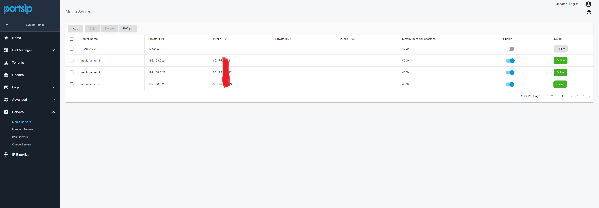
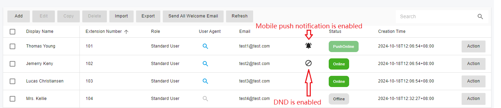
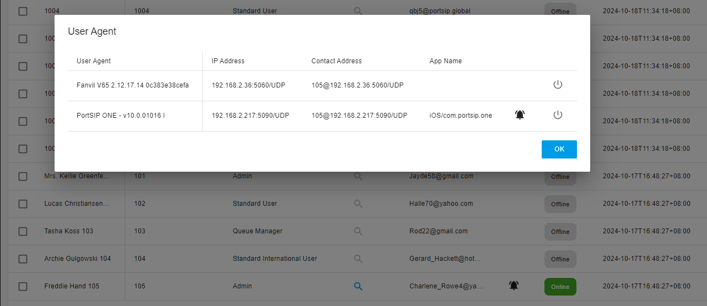
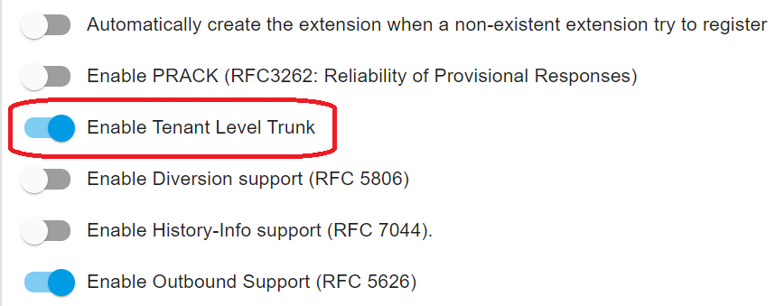

# The Advantages of PortSIP PBX vs. Other PBXs

The realm of communication technology is expanding at a breakneck pace, with contemporary cloud-based unified communication systems becoming the go-to choice for businesses of all sizes. As traditional phone systems are being utilized less and less, businesses are looking for more efficient communication solutions. With the scalability and flexibility offered by modern unified communication systems, it’s easy to see its significant advantages for those who have adjusted to remote and hybrid work models.

Between PortSIP PBX vs other PBXs for a business unified communications solution, what would you choose?

## Real Multi-Tenant PBX Designed for Cloud Age

Many vendors claim to provide multi-tenant PBXs, but most of their architecture is **pseudo-multi-tenant**. Typically, they need to install a new PBX instance for each tenant and then manage these instances through a centralized web portal. End-users are unaware of this, but for service providers, this is a significant issue:

* They need to maintain massive PBX instances.
* They waste server hardware resources.

For example, if a service provider has 1000 clients, each client is a tenant and needs to set up a PBX instance. Assume each tenant has about 10–50 extensions, and then the server resources and maintenance work are unimaginable!

PortSIP PBX provides a real multi-tenant PBX. Unlike other PBXs that require a separate PBX instance for each tenant, PortSIP PBX allows service providers to set up one instance and create thousands of tenants in that PBX instance. Each tenant can have its settings and extension numbers and is invisible to other tenants, the tenant just feels he has a whole PBX. This is an excellent feature that can save hardware resources and reduce maintenance work.

<figure><figcaption></figcaption></figure>

As shown in the screenshot above, the system administrator (service provider) or [dealers ](portsip-pbx-administration-guide/22-dealers.md)(distributor, sub-distributor, reseller) can view and manage all tenants in the web portal. The following actions are available:

* **Add**. Create a new tenant.
* **Manage**. Switch to the tenant administrator to manage the extensions, call routings, etc.
* **Edit**. Change the settings of the tenant. For example, limit the capability of that tenant.
* **Disable**. Disable the tenant temporarily. All settings and data will be preserved and can be enabled again at any time.
* **Delete**. Delete the tenant from the PBX. All data of that tenant will be erased and can’t be recovered.

This is what modern multi-tenant PBX architecture is designed for in the cloud age. PortSIP has done an excellent job with this, and our clients are enjoying it a lot.

## Full White-label Solution

White-label solutions refer to products or services that are created by one company for the purpose of being sold by another company under that company’s own unique branding.

Building your brand is never easy, but PortSIP can help you get there. Our rebranding feature allows you to fully private label your PBX and cloud PBX service and make it your own, including the following elements:

* Theme
* Product Name&#x20;
* Company Name&#x20;
* Website Link&#x20;
* Logo Favicon&#x20;
* User Agent string of PortSIP PBX and SBC&#x20;
* WebRTC, Windows, and Mobile Apps&#x20;
* IP Phone Templates&#x20;
* Notification Email Templates

You can focus on the marketing, sales, and billing of your services, and we'll take care of the rest!

Please refer to the article [Rebranding PortSIP PBX, SBC](portsip-pbx-administration-guide/rebranding-portsip-pbx-sbc.md) for more details.

## A Scalable Communications Platform

For cloud multi-tenant PBXs, the service provider hosts the PBX in the cloud and provides the calling service to users. Unlike single-tenant PBXs for SMBs, this means massive tenants and simultaneous calls are handled by the cloud PBX. The PBX vendor must take care of the performance.

PortSIP PBX is designed for the cloud age and offers high performance. It can handle massive extensions (users) and simultaneous calls. For large-size deployments, the PBX can extend the below servers for the cluster:

* Queue Server
* Meeting Server
* IVR Server
* Media server

With the extended servers cluster, the PBX Call Manager server only needs to process signaling. Utilizing multiple threads and cache technologies enables a PortSIP PBX instance to handle up to 100K users and 20K simultaneous calls. This is an impressive feat that meets most service providers’ scenarios.

<figure><figcaption></figcaption></figure>

As shown in the screenshot above, we disabled the **default media server** in the PBX server and extended three media servers in order to handle heavy calls.

## Designed for High Performance

When designing a cloud PBX, every feature needs to be considered deeply, since it may cause the performance issue when the tenants and users amount is large.

For instance, for the call park feature, as per traditional PBX design, the PBX needs to create a dozen park spots for each tenant. In reality, these spots are PBX extensions that need to register with the PBX and refresh the registration period. The extensions also need to subscribe to these spot extensions for the dialog event in order to receive an alert when a call has been parked on the spot. Additionally, the extensions need to maintain their subscription by sending the SUBSCRIBE message periodically.

Assume each tenant creates 5 park spots, then for a cloud PBX with 1k tenants, there will need to be 5K park spots (extensions) created for the tenants. As mentioned above, these spots are actually PBX extensions. The registration and subscription of these spots will consume massive CPU, memory, and bandwidth resources and reduce cloud PBX performance. This is unacceptable for service providers. It’s hard to imagine if tenants need to create more park spots!

PortSIP pays attention to each feature for multi-tenancy. In order to avoid the problems of traditional PBXs, PortSIP has designed the call parking feature in a unique way that is easy to use and more friendly. It also has good performance and uses fewer resources. You can find more details in this article: [Call Parking](portsip-pbx-administration-guide/14-call-parking/).

## Seamless Migration from BroadSoft

PortSIP PBX also offers [rich features](pbx\_v12/tutorials/portsip-pbx-features.md) that are different from other PBX, most of the features are like the Broadsoft, for example, the Feature Access Codes (dial codes).

These PortSIP PBX feature access codes are mostly the same as Broadsoft and allow users to work more easily. Each tenant can customize its own feature access code to meet their user experience needs. You can find more details in this article: [Feature Access Codes](portsip-pbx-administration-guide/23-feature-access-codes.md).

## Modern Unified Collaboration Solution

PortSIP PBX also offers a free comprehensive collaboration and communication solution for hybrid work, enabling inclusive experiences for everyone while protecting your data with industry-leading security. It provides calling, messaging, meetings, and sharing in a unified experience across web, desktop, and mobile apps.

All the ways to connect:

* Audio and Video Calling
* Audio and Video Meetings
* Messaging
* Audio Messaging
* Video Messaging
* Screen Sharing
* File Sharing

## Effortless User Management

The tenant administrator can manage users easily through the user list in the PBX web portal, where all extension statuses are listed and indicate whether they are **online/offline/on call/push notification enabled/automatic callback enabled/DND enabled**.

<figure><figcaption></figcaption></figure>

You can click on the search icon to check an online extension's device details.

As shown in the below screenshot, extension 102 is registered from a PortSIP UC client (IP is 192.168.0.22, the port is 5960 over the UDP transport), and the Yealink T53 IP Phone (IP is 192.168.0.36, the port is 5060 over the UDP transport).

<figure><figcaption></figcaption></figure>

You can find more details in the article: [User Management](portsip-pbx-administration-guide/5-user-management/).

## CDR and Recording

The call recording can be started automatically once the call is established. It can also be started in the middle of a call and can be paused/resumed during the call.

PortSIP PBX supports both audio and video recording and can record calls in MP3 or MP4 format, which makes it easy to play them in the browser.

The CDR is linked with the recording file, which can be downloaded and played in a browser.&#x20;

The PortSIP CDR feature is different from other PBXs in that if a call is rerouted and forwarded multiple times during the call, the PBX will tie all call targets in one CDR. This makes it easy to track the call flow.

For example, if a call comes from the SIP trunk and arrives at the PBX, then is routed to the IVR and re-routed to the queue by the user pressing DTMF, and an agent of the queue answers that call, all this information(callee number, callee IP address, and port) and timestamp are recorded in the CDR. For more details, please read this article: [CDR and Call Recording](the-advantages-of-portsip-pbx-vs.-other-pbxs.md#cdr-and-recording).

## Storing Into AWS S3

With PortSIP PBX, you can write your Video Recordings and Compositions to your own AWS (Amazon Web Services) S3 bucket, rather than a local disk. This guide explains how you can set up your own account or project to use this capability. For more details please read this article: [Storing into AWS S3](storing-into-aws-s3.md).

## Privacy

PortSIP PBX also takes care of the privacy of the recording. Due to privacy and security concerns in some countries, the law stipulates that when a call is made between two external numbers, it should not be recorded.

Consider the following scenario: The client calls the contact center from the trunk and the agent answers. The call is starting to be recorded, and after a while of conversation, the agent transfers the client’s call to another landline/mobile phone number, the call is now between two PSTN phone numbers. At this point, the PBX should stop the call recording automatically. PortSIP provides an option for this feature, please read the details in this article: [Automatically stop recording if the call between two external numbers](portsip-pbx-administration-guide/20-cdr-and-call-recordings/#automatically-stop-recording-if-the-call-between-two-external-numbers).

## Trunk Management

Different cloud PBX providers have varying requirements due to their unique business models.&#x20;

Some providers only host the cloud PBX and do not offer SIP trunks to tenants, requiring tenants to configure their own trunks.&#x20;

Other service providers offer cloud PBX and SIP trunk bundles, limiting tenant configuration of trunks. In this case, all trunks must be configured by the service provider, who assigns a range of DID numbers (DID pool) to tenants. Tenants can only use the trunk and DID numbers assigned by the service provider to create call routing rules.

Some service providers offer a hybrid mode that allows tenants to configure their own trunks and uses the trunks and DID numbers assigned by the service provider.

PortSIP PBX supports all requirements for service providers to meet their business models. An option called **Enable Tenant Level Trunk** allows service providers to enable or disable tenant trunk configuration. You can access this option by selecting the menu **Advanced > Settings** after signing in to the PBX web portal as the system administrator.

<figure><figcaption></figcaption></figure>

For more details, please read the article [Trunk Management.](portsip-pbx-administration-guide/7-trunk-management/)

## Webhook

PortSIP PBX supports sending the CDR and extension call events to a pre-configured webhook by the tenant admin. This allows the client to integrate the PBX with any third-party system. The webhook is in JSON format. For more details, please read this article: [Push CDR to Webhook](portsip-pbx-administration-guide/20-cdr-and-call-recordings/#push-cdr-to-webhook).

## Pub/Sub

PortSIP PBX provides the Pub/Sub mechanism which is based on the WebSocket (PortSIP WSI).&#x20;

The user is able to create the WebSocket in any programming language to subscribe to the PBX events, once the subscribed events occur, PortSIP PBX will send the event message to the subscriber automatically, the message is in the JSON format. For more details please read this article: [Going Real-Time with PortSIP PBX Pub/Sub](portsip-pbx-administration-guide/going-real-time-with-portsip-pbx-pub-sub.md).

## Dealers

The cloud PBX/UC service providers just need to focus on hosting the PBX system in the cloud, ensuring service operation, and providing continuous stable service.&#x20;

Distributors/Resellers partner of the service providers to give out cloud PBX services and products to the customers.&#x20;

A distributor or the reseller purchases cloud PBX services and cloud-based PBX products from the cloud service provider and further sells them to the end users.

PortSIP PBX offers a great feature called **Dealers** for the above scenario that allows service providers to manage dealers (distributors and resellers) easily. For more details please read the article: [Dealers](the-advantages-of-portsip-pbx-vs.-other-pbxs.md#dealers).

## Flexibility Office Hours and Holidays

PortSIP PBX offers flexible office hours and holiday schedules for tenants located in different countries around the world to meet their local usage. For more details, please read the article: [Office Hours and Holiday Schedule](portsip-pbx-administration-guide/office-hours-and-holiday-schedule/).

## Free SBC

PortSIP PBX offers a free SBC to support WebRTC and Microsoft Teams Direct Routing. The SBC can be deployed as a cluster to support large calls:

* [Configuring SBC for WebRTC](portsip-pbx-administration-guide/9-configuring-sbc-for-webrtc.md)
* [Configuring SBC for MS Teams](portsip-pbx-administration-guide/10-configuring-sbc-for-ms-teams/)

## Microsoft 365 Integration

PortSIP PBX seamlessly integrates business communications into your cloud work environment, transforming Microsoft 365 into an enterprise-grade communications hub with a powerful and easy-to-use interface that is simple for end-users to deploy and IT to manage.

For more details, please read this article: [Microsoft 365 Integration](portsip-pbx-administration-guide/microsoft-365-integration.md).

## Open REST API

PortSIP PBX provides full REST API which means customers can easily integrate it with any 3rd system.

In fact, the PortSIP PBX Web Portal is also built based on this REST API: [PortSIP PBX REST API](https://www.portsip.com/pbx-rest-api/v16/html/index.html).&#x20;

## PortSIP VoIP SDK

PortSIP offers a VoIP SDK that can be used with PortSIP PBX to create modern UC apps. This award-winning SDK is used by many large companies such as T-Mobile, Nextiva, Qualcomm, Telstra, HPE, Siemens, Netflix, Agilent, and Dialogic: [PortSIP VoIP SDK](https://www.portsip.com/portsip-voip-sdk/).

## Push Notifications

A Voice over Internet Protocol (VoIP) app lets users make and receive phone calls by using an Internet connection instead of the device’s cellular service. Since the VoIP app relies heavily on the network, it’s not surprising that making calls usually results in high power consumption.

PortSIP PBX supports mobile push notifications for iOS and Android apps. All PortSIP users will benefit from this feature, for more details please read this article: [How Do Push Notifications Work with PortSIP PBX?](mobile-push-notifications/how-do-push-notifications-work-with-portsip-pbx.md)

## Rebranding App

PortSIP PBX has an app for the below OS:

* iOS
* Android
* Windows Desktop
* WebRTC

The apps can be rebranded for free if you purchase the extension license and reach X extensions.

## PortSIP PBX Solution Has Your Back

When weighing the solution for hosting the Cloud PBX, you have to look at your needs today and tomorrow. You have to ask yourself where you want to be in the next year or two and beyond.

Here at PortSIP, we’ll walk you through everything, including free porting of your existing solution. We’ll help you select the right VoIP desk phones that meet your client's budget and everyday business needs.

In the age of the cloud, you cannot keep inching along with a legacy PBX. Your traditional PBX solution costs you more than it’s saving.

Take advantage of PortSIP Solution and the freedom to work from anywhere. PortSIP PBX lets you focus on serving your customers, not trying to figure out the system. You can leave the rest to us.

