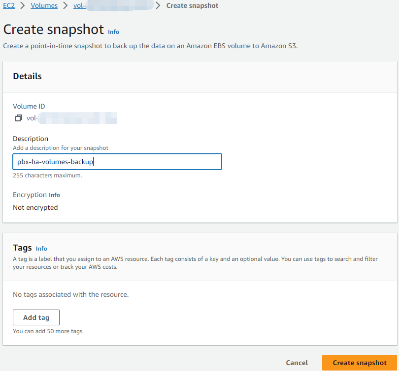

# Upgrading High Availability Installations


Before upgrading the PBX HA, please consult with PortSIP support to ensure the versions are compatible.


Please follow the below steps to upgrade your current PBX HA.

## Back up data

Before upgrading, you can create a snapshot of the EBS. This allows you to roll back your changes if necessary. Here are the steps to follow:

* In the Amazon EC2 console, in the navigation panel, choose **Elastic Block Store**, and select **Volumes**.
* Select the check box for your **Volume** that be used in HA, choose **Actions**, and **Create a snapshot**.
* Under Description, enter "pbx-ha-volumes-backup".
* Choose **Create Snapshot** to create a snapshot.

<figure><figcaption></figcaption></figure>

## Download and Update Resources

Perform the below command only on the EC2 instance **ip-172-31-16-133.**

```
cd /opt/ && rm -rf portsip-pbx-ha-on-aws-guide-16.tar.gz \
&& sudo wget -N https://www.portsip.com/downloads/ha/v16/portsip-pbx-ha-on-aws-guide-16.tar.gz \
&& sudo tar xf portsip-pbx-ha-on-aws-guide-16.tar.gz
```

## **Update PBX**

Use the new version image of PortSIP PBX to update the PBX.


Please contact PortSIP support to obtain the **\<PortSIP PBX new version image>** before upgrading.


Perform the below command only on the EC2 instance **ip-172-31-16-133.**

```
cd /opt/portsip-pbx-ha-guide/ && \
/bin/bash update.sh <replace with the newest docker image>
```


